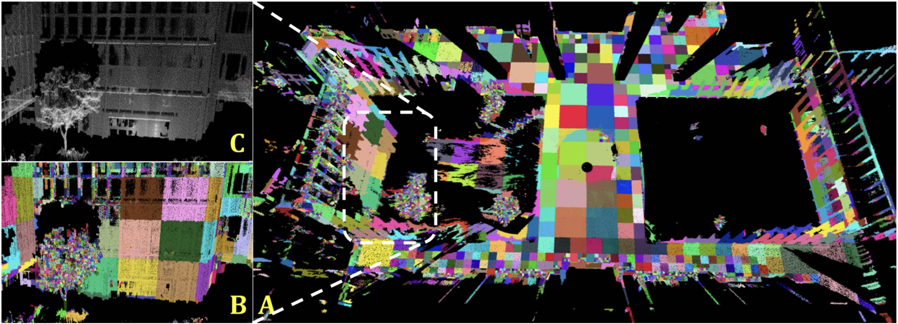
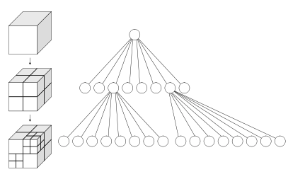

## 文章内容
>&nbsp;&nbsp;&nbsp;&nbsp;&nbsp;&nbsp;&nbsp;&nbsp;&nbsp;&nbsp;To find the correspondences among different LiDAR scans, we assume the initial base LiDAR trajectory $\mathcal{S}$, LiDAR extrinsic $\mathcal{E}_L$, and camera extrinsic $\mathcal{E}_C$ are available. The initial base LiDAR trajectory $\mathcal{S}$ could be obtained by an online LiDAR SLAM (e.g., [3]), and the initial extrinsic could be obtained from the CAD design or a rough Hand-Eye calibration [14].
Our previous work [5] extracts edge and plane feature points from each LiDAR scan and matches them to the nearby edge and plane points in the map by a $k$-nearest neighbor search ($k-NN$). This would repeatedly build a $k$-d tree of the global map at each iteration. In this paper, we use a more efficient voxel map proposed in [4] to create correspondences among all LiDAR scans.

&nbsp;&nbsp;&nbsp;&nbsp;&nbsp;&nbsp;&nbsp;&nbsp;为了找到不同雷达扫描之间的对应关系，我们假设初始的基准雷达轨迹$\mathcal{S}$、雷达外参$\mathcal{E}_L$、相机外参$\mathcal{E}_C$是可用的。初始的基准雷达轨迹$\mathcal{S}$可以通过实时雷达SLAM获得，而初始的外参可以通过CAD设计或者从粗略的手眼标定中获得。我们的前期工作，从每个雷达扫描中提取边缘和平面特征，并通过最邻域搜索，将他们匹配到地图中的临近边缘和平面。这会在每次迭代中重复构建全局地图的$k$-d树，在本文中，我们使用在文献4中提出的一种更为高效的体素地图来创建所有雷达扫描之间的对应关系。

>&nbsp;&nbsp;&nbsp;&nbsp;&nbsp;&nbsp;&nbsp;&nbsp;&nbsp;&nbsp;The voxel map is built by cutting the point cloud (registered using the current $\mathcal{S}$ and $\mathcal{E}_L$) into small voxels such that all points in a voxel roughly lie on a plane (with some adjustable tolerance). The main problem of the fixed-resolution voxel map is that if the resolution is high, the segmentation would be too time-consuming, while if the resolution is too low, multiple small planes in the environments falling into the same voxel would not be segmented. To best adapt to the environment, we implement an adaptive voxelization process. More specifically, the entire map is first cut into voxels with a pre-set size (usually large, e.g., 4m). Then for each voxel, if the contained points from all LiDAR scans roughly form a plane (by checking the ratio between eigenvalues), it is treated as a planar voxel; otherwise, they will be divided into eight octants, where each will be examined again until the contained points roughly form a plane or the voxel size reaches the pre-set minimum lower bound. Moreover, the adaptive voxelization is performed directly on the LiDAR raw points, so no prior feature points extraction is needed as in [5].

&nbsp;&nbsp;&nbsp;&nbsp;&nbsp;&nbsp;&nbsp;&nbsp;体素地图通过将点云（使用当前的 $\mathcal{S}$和 $\mathcal{E}_L$ 进行配准）切割成小的体素来构建，使得体素内的所有点大致位于同一平面上（具有一定的可调容差）。固定分辨率体素图的主要问题是，如果分辨率太高，分割将会非常耗时；而如果分辨率太低，环境中多个小平面落在同一个体素内时则无法进行分割。为了更好地适应环境，我们实现了自适应体素化过程。
具体来说，整个地图首先被切割成预设大小的体素（通常较大，例如4米）。然后对于每个体素，如果所有LiDAR扫描中包含的点大致形成一个平面（通过检查特征值之间的比率来判断），则将其视为平面体素；否则，这些体素将被分成八个八分之一体素（octants），每个都将再次进行检查，直到包含的点大致形成一个平面，或者体素尺寸达到预设的最小下限。此外，自适应体素化直接在LiDAR的原始点上执行，因此不需要像文献[5]那样预先提取特征点。

>&nbsp;&nbsp;&nbsp;&nbsp;&nbsp;&nbsp;&nbsp;&nbsp;&nbsp;&nbsp;Fig. 3 shows a typical result of the adaptive voxelization process in a complicated campus environment. As can be seen, this process is able to segment planes of different sizes, including large planes on the ground, medium planes on the building walls, and tiny planes on tree crowns.

Fig. 3: A) LiDAR point cloud segmented with the adaptive voxelization. Points within the same voxel are colored identically. The detailed adaptive voxelization of points in the dashed white rectangle could be viewed in B) colored points and C) original points. The default size for the initial voxelization is 4m, and the minimum voxel size is 0.25m.


图3展示了一个复杂校园环境中自适应体素化过程的典型结果。如图所示，该过程能够分割出不同大小的平面，包括地面上的大平面、建筑物墙面上的中等平面以及树冠上的小平面。

图3：(A) 使用自适应体素化分割的LiDAR点云。同一体素内的点被赋予相同的颜色。白色虚线矩形区域内的详细自适应体素化效果可以在 (B) 彩色点云和 (C) 原始点云中查看。初始体素化的默认大小为4米，而最小的体素大小为0.25米。

## 相关理论
论文中关于自适应体素并未提及到重要信息，但是提到了参考文献4[《BALM: Bundle Adjustment for Lidar Mapping》](https://www.arxiv.org/pdf/2010.08215)。
### 自适应体素化
&nbsp;&nbsp;&nbsp;&nbsp;&nbsp;&nbsp;&nbsp;&nbsp;我们在默认大小的3D空间中重复体素化，如果当前体素中的所有特征点都位于平面，则将当前体素与包含的特征点一起保存在内存中；否则，将当前体素分解为八个八分体，并继续检查每个八分体直到达到最小尺寸。在具体实现过程中有以下细节：
- 如果一个体素内包含太多的特征点，则会导致文章[《Chapter 01: Multi-LiDAR Extrinsic Calibration》]()中推导过程章节中二阶闭式导数中的Hessian矩阵维度过高，在这种情况下，我们可以将点进行平均，以实现降采样但不降低映射一致性；
- 同时，二阶闭式导数中的Hessian矩阵推导过程中提到$\lambda_m\ne\lambda_n$,因此当遇到$\lambda$的代数多重性大于1的体素需要跳过（忽略）；
- 只需检查体素所包含的点，是否位于同一平面时允许更大的方差，则能自然地扩展到非平面特征（BLAM只提到了平面特征和边缘特征）；
- 设置了两个条件来停止递归体素化：一个是树的最大深度，另一个是体素的最小点数。

&nbsp;&nbsp;&nbsp;&nbsp;&nbsp;&nbsp;&nbsp;&nbsp;其中，判断体素是否为平面的方法是计算体素内所有的点云的协方差矩阵，判断最大特征值与最小特征值的比值是否大于一定的阈值，如果大于则为平面：

首先计算中心点$p_c$,即所有点的均值点,如下所示：
$$
p_c=\frac{1}{N}\sum_{i=1}^{N}p_i
$$
接着计算协方差矩阵：
$$
\begin{align*}
C=\frac{1}{N}\sum_{i=1}^{N}\big(p_i - c\big)\big(p_i - c\big)^T\\
=\frac{1}{N}\sum_{i=1}^{N}\big(p_ip_i^T-p_ic^T-cp_i^T+cc^T\big)\\
=\frac{1}{N}\sum_{i=1}^{N}p_ip_i^T-\frac{1}{N}\sum_{i=1}^{N}p_ic^T
-c\big(\frac{1}{N}\sum_{i=1}^{N}p_i\big)^T+cc^T\\
=\frac{1}{N}\sum_{i=1}^{N}p_ip_i^T-cc^T-cc^T+cc^T\\
=\frac{1}{N}\sum_{i=1}^{N}p_ip_i^T-cc^T
\end{align*}
$$
### 八叉树数据结构



&nbsp;&nbsp;&nbsp;&nbsp;&nbsp;&nbsp;&nbsp;&nbsp;通过雷达获取的点云数据，具有数据量大、分布不均匀等特点。点云数据主要是表征目标表面的海量点集合，并不具备传统网格数据的集合拓扑信息。所以点云数据处理中最为核心的问题就是建立离散点间的拓扑关系，实现基于邻域关系的快速查找。

&nbsp;&nbsp;&nbsp;&nbsp;&nbsp;&nbsp;&nbsp;&nbsp;建立空间索引在点云数据处理中已被广泛应用，常见空间索引一般是自顶向下逐级划分空间的各种空间索引结构，比较有代表性的包括 BSP树、 KD树、 KDB树、 R树、 R+树、 CELL树、四叉树和八叉树等索引结构，而在这些结构中KD树和八叉树在3D点云数据组织中应用较为广泛。


&nbsp;&nbsp;&nbsp;&nbsp;&nbsp;&nbsp;&nbsp;&nbsp;八叉树（Octree）是一种用于描述三维空间的树状数据结构。八叉树的每个节点表示一个正方体的体积元素，每个节点有8个子节点，这八个子节点所表示的体积元素加在一起等于父节点的体积。一般中心点作为节点的分叉中心。八叉树若不为空树的话，树中任一节点的子节点恰好只会是8个或0个，不会是0或8以外的数目。八叉树叶子节点代表了分辨率最高的情况。例如分辨率设成0.01m，那么每个叶子就是一个1cm见方的小方块。

## 代码详解
### OCTO_TREE类
``` C++
class OCTO_TREE {
public:
    std::vector<vector_vec3d *> origin_pc;//原始三维数据
    std::vector<vector_vec3d *> transform_pc;//变换后的三维数据
    OCTO_TREE *leaves[8];

    int win_size,//帧数（旋转一圈）
     eigen_ratio;//面特征的阈值
    OT_STATE octo_state;
    int points_size, layer;

    double voxel_center[3];
    double quater_length;
    Eigen::Vector3d value_vector;

    OCTO_TREE(int window_size, double eigen_limit) : win_size(window_size), eigen_ratio(eigen_limit) {
        octo_state = UNKNOWN;
        layer = 0;
        for (int i = 0; i < 8; i++)
            leaves[i] = nullptr;

        for (int i = 0; i < win_size; i++) {
            origin_pc.emplace_back(new vector_vec3d());
            transform_pc.emplace_back(new vector_vec3d());
        }
    }

    ~OCTO_TREE() {
        for (int i = 0; i < win_size; i++) {
            delete (origin_pc[i]);
            delete (transform_pc[i]);
        }
        origin_pc.clear();
        transform_pc.clear();
        for (int i = 0; i < 8; i++)
            if (leaves[i] != nullptr)
                delete leaves[i];
    }

    /**
     * @brief recut函数用于对点云数据进行八叉树分割
     */
    void recut() {
        // 如果当前八叉树节点的状态未知，则进行分割决策
        if (octo_state == UNKNOWN) {
            // 初始化点大小为0，将窗口内的所有点的大小相加
            points_size = 0;
            for (int i = 0; i < win_size; i++)
                points_size += origin_pc[i]->size();

            // 两个停止递归体素化的条件之一：如果点的总大小小于最小值，则将当前节点标记为中间节点并返回
            if (points_size < MIN_PS) {
                octo_state = MID_NODE;
                return;
            }

            // 判断是否满足平面条件，如果满足则将当前节点标记为平面节点并返回
            if (judge_eigen()) {
                octo_state = PLANE;
                return;
            } else {
                // 两个停止递归体素化的条件之一： 如果当前层达到限制，则将当前节点标记为中间节点并返回
                if (layer == LAYER_LIMIT) {
                    octo_state = MID_NODE;
                    return;
                }

                // 遍历窗口内的每个点云，根据点的位置将其分配到相应的子节点
                for (int i = 0; i < win_size; i++) {
                    uint pt_size = transform_pc[i]->size();
                    for (uint j = 0; j < pt_size; j++) {
                        int xyz[3] = {0, 0, 0};
                        // 根据点的坐标确定它在当前八叉树节点的子节点中的位置
                        for (uint k = 0; k < 3; k++)
                            if ((*transform_pc[i])[j][k] > voxel_center[k])
                                xyz[k] = 1;

                        int leafnum = 4 * xyz[0] + 2 * xyz[1] + xyz[2];
                        // 如果当前子节点为空，则创建一个新的八叉树节点，并设置其参数
                        if (leaves[leafnum] == nullptr) {
                            leaves[leafnum] = new OCTO_TREE(win_size, eigen_ratio);
                            leaves[leafnum]->voxel_center[0] = voxel_center[0] + (2 * xyz[0] - 1) * quater_length;
                            leaves[leafnum]->voxel_center[1] = voxel_center[1] + (2 * xyz[1] - 1) * quater_length;
                            leaves[leafnum]->voxel_center[2] = voxel_center[2] + (2 * xyz[2] - 1) * quater_length;
                            leaves[leafnum]->quater_length = quater_length / 2;
                            leaves[leafnum]->layer = layer + 1;
                        }
                        // 将当前点添加到相应的子节点中
                        leaves[leafnum]->origin_pc[i]->push_back((*origin_pc[i])[j]);
                        leaves[leafnum]->transform_pc[i]->push_back((*transform_pc[i])[j]);
                    }
                }
            }
        }

        // 对每个子节点递归调用recut函数，继续进行分割
        for (int i = 0; i < 8; i++)
            if (leaves[i] != nullptr)
                leaves[i]->recut();
    }

    /**
     * @brief 计算和判断给定点云数据的协方差矩阵的特征值的比值
                是本文2.1节的协方差矩阵计算的具体实现
     * @return bool 根据特征值的比值判断返回true或false
     */
    bool judge_eigen() {
        Eigen::Matrix3d covMat(Eigen::Matrix3d::Zero());
        Eigen::Vector3d center(0, 0, 0);
        for (int i = 0; i < win_size; i++) {
            uint pt_size = transform_pc[i]->size();
            for (uint j = 0; j < pt_size; j++) {
                covMat += (*transform_pc[i])[j] * (*transform_pc[i])[j].transpose();
                center += (*transform_pc[i])[j];
            }
        }
        // 计算中心点
        center /= points_size;
        // 计算协方差矩阵
        covMat = covMat / points_size - center * center.transpose();
        // 使用Eigen库计算协方差矩阵的特征值
        Eigen::SelfAdjointEigenSolver<Eigen::Matrix3d> saes(covMat);
        value_vector = saes.eigenvalues();
        // 判断特征值的比值是否大于给定的阈值，是则返回true，否则返回false  
        // Eigen::SelfAdjointEigenSolver 求解的特征值默认从小到大排序。
        if (eigen_ratio < saes.eigenvalues()[2] / saes.eigenvalues()[0]) return true;
        return false;
    }

    /**
     * @brief 对点云根据特征分类进行颜色渲染
     * @param cloud 变换到世界坐标系的点云
     */
    void tras_display(pcl::PointCloud<pcl::PointXYZINormal>::Ptr &cloud) {
        float ref = 255.0 * rand() / (RAND_MAX + 1.0f);
        pcl::PointXYZINormal ap;
        ap.intensity = ref;

        if (octo_state == PLANE) {
            for (int i = 0; i < win_size; i++)
                for (uint j = 0; j < transform_pc[i]->size(); j++) {
                    ap.x = (*transform_pc[i])[j](0);
                    ap.y = (*transform_pc[i])[j](1);
                    ap.z = (*transform_pc[i])[j](2);
                    ap.normal_x = sqrt(value_vector[1] / value_vector[0]);
                    ap.normal_y = sqrt(value_vector[2] / value_vector[0]);
                    ap.normal_z = sqrt(value_vector[0]);
                    cloud->points.push_back(ap);
                }
        } else {
            if (layer == LAYER_LIMIT) return;
            layer++;
            for (int i = 0; i < 8; i++)
                if (leaves[i] != nullptr)
                    leaves[i]->tras_display(cloud);
        }
    }

    void feed_pt(LM_OPTIMIZER &lm_opt) {
        if (octo_state == PLANE)
            lm_opt.push_voxel(origin_pc);
        else
            for (int i = 0; i < 8; i++)
                if (leaves[i] != nullptr)
                    leaves[i]->feed_pt(lm_opt);
    }
};
```
### downsample_voxel体素下采样函数
``` C++
/**
 * @brief 基于体素网格对点云进行下采样
 *        本文自适应体素化章节提到，如果一个体素内包含太多点，
 *        则会导致二阶闭式导数中的Hessian矩阵维度过高，在这种
 *        情况下可以进行将点进行一下平均，以降低维度
 * @param pc 输入和输出的点云数据
 * @param voxel_size 体素网格的大小，决定了下采样的精度
 * @return
 */
void downsample_voxel(pcl::PointCloud<PointType>& pc, double voxel_size)
{
    // 检查体素大小是否过小，如果小于0.01则不进行下采样
    if (voxel_size < 0.01)
        return;

    // 使用哈希表存储每个体素网格中的点，以实现快速查找和去重
    std::unordered_map<VOXEL_LOC, M_POINT> feature_map;
    size_t pt_size = pc.size();

    // 遍历每个点，计算其在体素网格中的位置，并将点加入相应的体素网格
    for (size_t i = 0; i < pt_size; i++)
    {
        PointType &pt_trans = pc[i];
        float loc_xyz[3];
        // 计算点在每个维度上所在的体素网格索引
        for (int j = 0; j < 3; j++)
        {
            loc_xyz[j] = pt_trans.data[j] / voxel_size;
            // 如果点的体素网格索引小于0，则减去1，保证索引非负
            if (loc_xyz[j] < 0)
                loc_xyz[j] -= 1.0;
        }

        // 构造体素网格位置的键
        VOXEL_LOC position((int64_t)loc_xyz[0], (int64_t)loc_xyz[1], (int64_t)loc_xyz[2]);
        // 在哈希表中查找当前体素网格位置
        auto iter = feature_map.find(position);
        if (iter != feature_map.end())
        {
            // 如果当前体素网格已存在点，则累加点的坐标，并增加点的计数
            iter->second.xyz[0] += pt_trans.x;
            iter->second.xyz[1] += pt_trans.y;
            iter->second.xyz[2] += pt_trans.z;
            iter->second.count++;
        }
        else
        {
            // 如果当前体素网格不存在点，则创建新的体素网格点，并加入哈希表
            M_POINT anp;
            anp.xyz[0] = pt_trans.x;
            anp.xyz[1] = pt_trans.y;
            anp.xyz[2] = pt_trans.z;
            anp.count = 1;
            feature_map[position] = anp;
        }
    }

    // 重新计算下采样后的点云大小，并清空原有数据
    pt_size = feature_map.size();
    pc.clear();
    pc.resize(pt_size);

    // 遍历哈希表，计算每个体素网格点的平均坐标，并填充到输出点云数据中
    size_t i = 0;
    for (auto iter = feature_map.begin(); iter != feature_map.end(); ++iter)
    {
        pc[i].x = iter->second.xyz[0] / iter->second.count;
        pc[i].y = iter->second.xyz[1] / iter->second.count;
        pc[i].z = iter->second.xyz[2] / iter->second.count;
        i++;
    }
}
```
### cut_voxel体素裁剪函数
``` C++
/**
 * @brief 对特征点云进行体素裁剪，根据给定的特征点云和变换参数，构建体素结构并更新特征地图。
 *
 * @param feature_map 特征地图，存储体素位置和对应的八叉树指针的哈希表。
 * @param feature_pts 特征点云数据。
 * @param q 旋转矩阵，表示特征点云相对于世界坐标的旋转。在本文中来源于初始可用的基准雷达的轨迹$\mathcal{S}$
 * @param t 平移向量，表示特征点云相对于世界坐标的平移。
 * @param f_head 特征头索引，用于标识特征点云中的特定部分。
 * @param window_size 窗口大小，用于体素中点云数据的窗口化处理。
 * @param eigen_threshold 特征值阈值，用于体素中点云数据的特征提取。
 */
void cut_voxel(unordered_map<VOXEL_LOC, OCTO_TREE*>& feature_map,
               pcl::PointCloud<PointType>::Ptr feature_pts,
               Eigen::Quaterniond q, Eigen::Vector3d t, int f_head, int window_size, double eigen_threshold)
{
    uint pt_size = feature_pts->size();

    for(uint i = 0; i < pt_size; i++)
    {
        PointType& pt = feature_pts->points[i];
        Eigen::Vector3d pt_origin(pt.x, pt.y, pt.z);
        // 根据旋转和平移参数，将点从基准雷达坐标系转换到世界坐标系
        Eigen::Vector3d pt_trans = q * pt_origin + t;
        float loc_xyz[3];
        // 计算点在体素空间中的位置
        for(int j = 0; j < 3; j++)
        {
            loc_xyz[j] = pt_trans[j] / voxel_size;
            // 确保体素位置为整数，因此对负值进行调整
            if(loc_xyz[j] < 0)
                loc_xyz[j] -= 1.0;
        }


        VOXEL_LOC position((int64_t)loc_xyz[0], (int64_t)loc_xyz[1], (int64_t)loc_xyz[2]);
        // 在特征地图中查找当前体素位置对应的八叉树
        auto iter = feature_map.find(position);
        if(iter != feature_map.end())
        {
            // 将点添加到已存在的八叉树的原始点云和变换点云中
            iter->second->origin_pc[f_head]->push_back(pt_origin);
            iter->second->transform_pc[f_head]->push_back(pt_trans);
        }
        else
        {
            // 如果未找到，创建一个新的八叉树
            OCTO_TREE* ot = new OCTO_TREE(window_size, eigen_threshold);
            // 将点添加到新的八叉树的原始点云和变换点云中
            ot->origin_pc[f_head]->push_back(pt_origin);
            ot->transform_pc[f_head]->push_back(pt_trans);

            // 设置八叉树的体素中心
            ot->voxel_center[0] = (0.5 + position.x) * voxel_size;
            ot->voxel_center[1] = (0.5 + position.y) * voxel_size;
            ot->voxel_center[2] = (0.5 + position.z) * voxel_size;
            // 设置八叉树的特征体素长度
            ot->quater_length = voxel_size / 4.0;
            // 初始化八叉树的层级
            ot->layer = 0;
            // 将新的八叉树添加到特征地图中
            feature_map[position] = ot;
        }
    }
}
```
<span style="color:red">正在持续更新中！</span>
## 参考文献

[1][《Targetless Extrinsic Calibration of Multiple Small FoV LiDARs and Cameras using Adaptive Voxelization》](https://arxiv.org/pdf/2109.06550)

[2][《BALM: Bundle Adjustment for Lidar Mapping》](https://www.arxiv.org/pdf/2010.08215)

[3][《octree八叉树数据结构原理与实现》](https://www.cnblogs.com/Glucklichste/p/11505743.html)