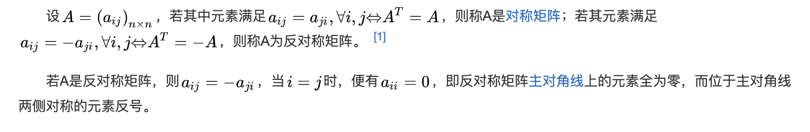

## 文章内容

> &nbsp;&nbsp;&nbsp;&nbsp;&nbsp;&nbsp;&nbsp;&nbsp;&nbsp;&nbsp;&nbsp;&nbsp;With adaptive voxelization, we can obtain a set 
of voxels of different sizes. Each voxel contains points that are roughly on a plane and creates a planar constraint for 
all LiDAR poses that  have points in this voxel. More specifically, considering the $l-th$ voxel consisting of a group of
 points $\mathcal{P}_{l}={_{}^{G}P_{L_{i},t_{j}}}$ scanned by $L_{i} \in \mathcal{L}$ at times $t_{j} \in \mathcal{T}$. 
 We define a point cloud consistency  indicator $_{c_{l}}(_{L_{i}}^{G}T_{t_{j}})$ which forms a factor on $\mathcal{S}$ and $\mathcal{E}_{L}$ shown 
 in Fig. 4(a). Then, the base LiDAR trajectory and extrinsic are estimated by optimizing the factor graph. A natural choice   for the consistency 
 indicator $c_{l}(\cdot)$ would be the summed Euclidean distance between each $_{}^{G}P_{L_{i},t_{j}}$ the plane to be estimated (see Fig. 4(b)). 
 Taking account of all such indicators within the voxel map, we could formulate the problem as $$\arg\min_{{\mathcal{S},\mathcal{E}_{L},{n}_{l},{q}_{l}}}\sum_{l}\underbrace{{\left(\frac{1}{N_{l}}\sum_{k=1}^{{N_{l}}}\left({n}_{l}^{T}\left(^{G}{p}_{k}-{q}_{l}\right)\right)^{2}\right)}}_{{l\mathrm{-th~factor}}}$$， where $_{}^{G}p_{k}\in \mathcal{P}_{l}$, $N_{l}$ is the total number of points in $\mathcal{P}_{l}$, $n_{l}$ is the normal vector of the plane and $q_{l}$ is a point on this plane.

Fig.4 :(a) The $l-th$ factor item relating to $\mathcal{S}$ and $\mathcal{E}_{L}$ with $L_{i} \in \mathcal{L}$ and $t_{j} \in \mathcal{T}$ . (b) The distance from the point $_{}^{G}p_{k}$ to the plane $\pi$.

 &nbsp;&nbsp;&nbsp;&nbsp; &nbsp;&nbsp;&nbsp;&nbsp;通过自适应体素化，我们可以获得一组不同大小的体素。
 每个体素包含大致在一个平面上的点，并为所有包含在此体素内的雷达姿态创建一个平面约束。
 更具体地说，考虑由$L_{i} \in \mathcal{L}$在时刻$t_{j} \in \mathcal{T}$扫描的一组点组成的第$l$个体素。
 我们定义了一个点云一致性指标$_{c_{l}}(_{L_{i}}^{G}T_{t_{j}})$ ，
 它在图4(a)中形成了$\mathcal{S}$ 和 $\mathcal{E}_{L}$上的因子。然后，通过优化因子图来估计基准雷达的轨迹和外参。
 对于一致性指标$c_{l}(\cdot)$的一个自然选择是计算每个$_{}^{G}P_{L_{i},t_{j}}$到平面的欧几里得距离之和（见图4(b)）。
 考虑到体素图中所有这样的指标，我们可以将问题表述为
 $$\arg\min_{{\mathcal{S},\mathcal{E}_{L},{n}_{l},{q}_{l}}}\sum_{l}\underbrace{{\left(\frac{1}{N_{l}}\sum_{k=1}^{{N_{l}}}\left({n}_{l}^{T}\left(^{G}{p}_{k}-{q}_{l}\right)\right)^{2}\right)}}_{{l\mathrm{-th~factor}}}$$
 ，其中 $_{}^{G}p_{k}\in \mathcal{P}_{l}$，$N_{l}$ 是 $\mathcal{P}_{l}$中所有点的总点数, $n_{l}$ 是平面的
 法向量， $q_{l}$ 是平面中的一点。
 
 Fig.4 :(a) 第$l$ 个因子项，涉及$\mathcal{S}$ 和 $\mathcal{E}_{L}$，其中  $L_{i} \in \mathcal{L}$ 
 且 $t_{j} \in \mathcal{T}$ 。 (b)点 $_{}^{G}p_{k}$到平面$\pi$的距离.

 > &nbsp;&nbsp;&nbsp;&nbsp;&nbsp;&nbsp;&nbsp;&nbsp;&nbsp;&nbsp;&nbsp;&nbsp;&nbsp;&nbsp;It is noticed 
 that the optimization variables $(n_{l}, q_{l})$ in (2) could be analytically solved (see Appendix A
  and the resultant cost function (3) is over the LiDAR pose $_{L_{i}}^{G}T_{t_{j}}$ (hence the base
   LiDAR trajectory $\mathcal{S}$ and extrinsic $\mathcal{E}_{L}$) only, as follows 
$$ \arg\min_{\mathcal{S},\mathcal{E}_{L}}\sum_{l}^{}\lambda_{3}(A_{l}) $$ 
where $\lambda_{3}(A_{l})$ denotes the minimal eigenvalue of matrix $A_{l}$ defined as 
$$ A_{l}=\frac{1}{N_{l}}\sum_{k=1}^{N_{l}}{_{}^{G}p_{k} \cdot_{}^{G}p_{k}^{T}-q_{l}^{\ast}\cdot {q_{l}^{\ast}}^{T}},q_{l}^{\ast} =\frac{1}{N_{l}}\sum_{k=1}^{N_{l}}{_{}^{G}p_{k}}
$$ 
. To allow efficient optimization in (3), we derive the closedform derivatives w.r.t the optimization 
variable $x$ up to secondorder (the detailed derivation from (3) to (5) is elaborated in Appendix B):
$$\lambda_3({x}\boxplus\delta{x})\approx\lambda_3({x})+{\bar{J}}\delta{x}+\frac12\delta{x}^T{\bar{H}}\delta{x}$$
 ,where $\bar{J}$ is the Jacobian matrix, and $\bar{H}$  is the Hessian matrix.
 The $\delta{x}$  is a small perturbation of the optimization variable $x$:
 $${x}=[\underbrace{\cdots_{L_{0}}^{G}{R}_{t_{j}}\quad L_{0}^{G}{t}_{t_{j}}\cdots}_{\mathcal{S}}\underbrace{\cdots {}_{L_{i}}^{L_{0}}{R}\quad{}_{L_{i}}^{L_{0}}{t}\cdots}_{\mathcal{E}_{L}}]$$
  .Then the optimal $x^{\ast}$ could be determined by iteratively solving (6) with the LM method 
and updating the $\delta{x}$ to $x$.
$$(\bar{{H}}+\mu{I}) \delta{x}=-\bar{{J}}^T$$

 &nbsp;&nbsp;&nbsp;&nbsp; &nbsp;&nbsp;&nbsp;&nbsp;注意到优化变量$(n_{l}, q_{l})$在方程(2)中可以解析求解（详见附录A）,由此得到的损失函数(3)仅关于雷达姿态$_{L_{i}}^{G}T_{t_{j}}$(即基准雷达轨迹$\mathcal{S}$和外参$\mathcal{E}_{L}$),如下所示：
$$ \arg\min_{\mathcal{S},\mathcal{E}_{L}}\sum_{l}^{}\lambda_{3}(A_{l}) $$
其中$\lambda_{3}(A_{l})$表示矩阵 $A_{l}$的最小特征值， $A_{l}$定义为$$ A_{l}=\frac{1}{N_{l}}\sum_{k=1}^{N_{l}}{_{}^{G}p_{k} \cdot_{}^{G}p_{k}^{T}-q_{l}^{\ast}\cdot {q_{l}^{\ast}}^{T}},q_{l}^{\ast} =\frac{1}{N_{l}}\sum_{k=1}^{N_{l}}{_{}^{G}p_{k}}$$
。为了使式(3)中的优化高效，我们推导了优化变量$x$的二阶闭式导数(从(3)到(5)的详细推导见附录B)：
$$\lambda_3({x}\boxplus\delta{x})\approx\lambda_3({x})+{\bar{J}}\delta{x}+\frac12\delta{x}^T{\bar{H}}\delta{x}$$
。其中$\bar{J}$是雅可比矩阵，$\bar{H}$是海森矩阵。$\delta{x}$是优化变量$x$的小扰动：
$${x}=[\underbrace{\cdots_{L_{0}}^{G}{R}_{t_{j}}\quad L_{0}^{G}{t}_{t_{j}}\cdots}_{\mathcal{S}}\underbrace{\cdots_{L_{i}}^{L_{0}}{R}\quad {}_{L_{i}}^{L_{0}}{t}\cdots}_{\mathcal{E}_{L}}]$$
。然后，最优解$x^{\ast}$可以通过迭代求解公式(6)并使用LM的方法更新$\delta{x}$到$x$来确定。
$$(\bar{{H}}+\mu{I}) \delta{x}=-{\bar{{J}}}^T$$
## 理论推导
### 损失函数的降维
#### 推导一：BALM论文的思路
$$\arg\min_{{\mathcal{S},\mathcal{E}_{L},{n}_{l},{q}_{l}}}\sum_{l}\underbrace{{\left(\frac{1}{N_{l}}\sum_{k=1}^{{N_{l}}}\left({n}_{l}^{T}\left(^{G}{p}_{k}-{q}_{l}\right)\right)^{2}\right)}}_{{l\mathrm{-th~factor}}}$$
观察上式可知，由于对于平面参数$\pi=(n_{l},q_{l})$的依赖，原始误差函数优化的维度很高。因为平面参数$(n_{l},q_{l})$对于不同的平面是有区别的。我们可以对它们进行优化，如下式所示：
$$\arg\min_{{\mathcal{S},\mathcal{E}_{L}}}\sum_{l}{\left(\min_{n_{l},q_{l}}{\frac{1}{N_{l}}{\sum_{k=1}^{N_{l}} \left( n_{l}^{T}\left( {^{G}p_{k}-q_{l}}\right)\right)^{2}}} \right)} $$
在$(n_{l},q_{l})$两个平面参数优化过程中可以优先优化$q_{l}$，再优化$n_{l}$，下式为优化$q_{l}$。
$$\begin{align*}\arg\min_{n_{l},q_{l}}{\frac{1}{N_{l}}{\sum_{k=1}^{N_{l}} \left( n_{l}^{T}\left( {^{G}p_{k}-q_{l}}\right)\right)^{2}}} \\
= \arg\min_{n_{l}}\left( \min_{q_{l}}{\frac{1}{N_{l}}{\sum_{k=1}^{N_{l}} \left( n_{l}^{T}\left( {^{G}p_{k}-q_{l}}\right)\right)^{2}}}\right)\\
=\arg\min_{n_{l}}n_{l}^{T}\left( \min_{q_{l}}{\frac{1}{N_{l}}{\sum_{k=1}^{N_{l}} \left( {^{G}p_{k}-q_{l}}\right)^{2}}}\right)n_{l}
 \end{align*}$$
 继续简化关于$q_{l}$参数的优化
 $$\begin{align*}\arg\min_{q_{l}}{\frac{1}{N_{l}}{\sum_{k=1}^{N_{l}} \left( {^{G}p_{k}-q_{l}}\right)^{2}}}\\
 =\min_{q_{l}}{\frac{1}{N_{l}}{\sum_{k=1}^{N_{l}} \left( {^{G}p_{k}-q_{l}}\right)\left( {^{G}p_{k}-q_{l}}\right)^{T}}}\end{align*}$$
 需要求当上式最小化是$q_{l}$的最优解，我们需要找到上式梯度为0的$q_{l}$的值，因此我们对上式求关于$q_{l}$的导数，如下所示：
$$\begin{align*}\frac{\partial}{\partial{q_{l}}} \left( {\frac{1}{N_{l}}{\sum_{k=1}^{N_{l}} \left( {^{G}p_{k}-q_{l}}\right)\left( {^{G}p_{k}-q_{l}}\right)^{T}}}\right) \\
={\frac{1}{N_{l}}{\sum_{k=1}^{N_{l}}  {-({^{G}p_{k}-q_{l})}^{T}}-\left( {^{G}p_{k}-q_{l}}\right)}}\\
= {\frac{1}{N_{l}}{\sum_{k=1}^{N_{l}}  {-2({^{G}p_{k}-q_{l})}}}}\\
=-{\frac{2}{N_{l}}{\sum_{k=1}^{N_{l}}  {({^{G}p_{k}-q_{l})}}}}
\end{align*}$$
令上式等于0：
$$\begin{align*}-{\frac{2}{N_{l}}{\sum_{k=1}^{N_{l}}  {({^{G}p_{k}}-q_{l})}}}=0 \\
 \sum_{k=1}^{N_{l}}{({^{G}p_{k}-q_{l}})} =0\\
 \sum_{k=1}^{N_{l}}{^{G}p_{k}}-N_{l}q_{l}=0\\
 N_{l}q_{l}=\sum_{k=1}^{N_{l}}{^{G}p_{k}}\\
 q_{l}=\frac{1}{N_{l}}\sum_{k=1}^{N_{l}}{^{G}p_{k}}
 \end{align*}$$
由此可知，最优的$q_{l}$是所有$^{G}p_{k}$的均值$q_{l}^{\ast}$,接下来继续简化$n_{l}$
$$\begin{align*}\arg\min_{n_{l}}n_{l}^{T}\left( \min_{q_{l}}{\frac{1}{N_{l}}{\sum_{k=1}^{N_{l}} \left( {^{G}p_{k}-q_{l}}\right)^{2}}}\right)n_{l}\\
=\arg\min_{n_{l}}n_{l}^{T}\left( {\frac{1}{N_{l}}{\sum_{k=1}^{N_{l}} \left( {^{G}p_{k}-q_{l}^{\ast}}\right)^{2}}}\right)n_{l}\end{align*}$$
其中，$${\frac{1}{N_{l}}{\sum_{k=1}^{N_{l}} \left( {^{G}p_{k}-q_{l}^{\ast}}\right)^{2}}}\\
\Leftrightarrow \frac{1}{N_{l}}\sum_{k=1}^{N_{l}}{_{}^{G}p_{k} \cdot_{}^{G}p_{k}^{T}-q_{l}^{\ast}\cdot {q_{l}^{\ast}}^{T}} $$
需要注意的是上式中$q_{l}^{\ast} \cdot_{}^{G}p_{k}^{T}$与$_{}^{G}p_{k}\cdot{q_{l}^{\ast}}^{T}$两个交叉项在最小化过程中不会对优化结果产生影响，所以两式等价。
所以，带入$$ A_{l}=\frac{1}{N_{l}}\sum_{k=1}^{N_{l}}{_{}^{G}p_{k} \cdot_{}^{G}p_{k}^{T}-q_{l}^{\ast}\cdot {q_{l}^{\ast}}^{T}},q_{l}^{\ast} =\frac{1}{N_{l}}\sum_{k=1}^{N_{l}}{_{}^{G}p_{k}}$$
$$\begin{align*}\arg\min_{n_{l}}n_{l}^{T}\left( {\frac{1}{N_{l}}{\sum_{k=1}^{N_{l}} \left( {^{G}p_{k}-q_{l}^{\ast}}\right)^{2}}}\right)n_{l}\\
=\arg\min_{n_{l}}n_{l}^{T}A_{l}n_{l}\end{align*}$$
根据瑞利商定理，对矩阵$M$满足如下性质：
$$\lambda_{min}(M)\le \frac{x^{T}Mx}{x^{T}x}\le\lambda_{max}(M),\forall{x}\ne0$$
则关于误差函数，取得最小化，变量$(n_{l}, q_{l})$的优化为公式$$\begin{align*}\
=\lambda_{min}(A_{l})\\arg\min_{n_{l}}n_{l}^{T}\left( \min_{q_{l}}{\frac{1}{N_{l}}{\sum_{k=1}^{N_{l}} \left( {^{G}p_{k}-q_{l}}\right)^{2}}}\right)n_{l}\\
=\lambda_{3}(A_{l})\end{align*}$$
将其带入$$\begin{align*}\arg\min_{{\mathcal{S},\mathcal{E}_{L}}}\sum_{l}{\left(\min_{n_{l},q_{l}}{\frac{1}{N_{l}}{\sum_{k=1}^{N_{l}} \left( n_{l}^{T}\left( {^{G}p_{k}-q_{l}}\right)\right)^{2}}} \right)}\\
=\arg\min_{{\mathcal{S},\mathcal{E}_{L}}}\sum_{l}{\lambda_{3}(A_{l})}\end{align*}$$

补充内容：由上述图4可知，$n_{l}^{T}({}^{G}p_{k}-q_{l})$表达了点${}^{G}p_{k}$到平面$\pi$的距离，其推导来源于向量法求点到平面的距离。如下图所示：

#### 推导二：该论文中的推导思路
<span style="color:red;">后续补充！</span>
### 二阶闭式导数的推导
首先引入BALM中两个定理，如下所示:
#### 定理1
> 已知：$${A}=\frac1N\sum_{i=1}^N\left({p}_i-\bar{{p}}\right)\left({p}_i-\bar{{p}}\right)^T,\bar{{p}}=\frac{1}{N}\sum_{i=1}^{N}{p}_{i}$$
对于一组点$p_{i}\left(i=1,\dots,\right)$和定义的协方差矩阵$A$,假设$A$具有对应于特征向量的$u_{k}\left(k=1,2,3\right)$,则有$$\frac{\partial\lambda_k}{\partial{p}_i}=\frac2N({p}_i-\bar{{p}})^T{u}_k{u}_k^T$$其中,$\bar{p}$是$N$个点的均值。

**证明如下**：假设点$p_i= [x_{i} \quad y_{i} \quad z_{i}]^{T}$以及对应的特征向量矩阵$U={[u_{1} \quad u_{2} \quad u_{3} ]}^{T}$。进一步定义$p$是$p_{i}$的一个元素，$p$是$x_{i},y_{i},z_{i}$中其中一个。协方差矩阵$A$可以分解为
$\Lambda=U^{T}AU$,其中:
- $\Lambda$是对角矩阵，其对角线元素是特征值,
$\lambda_{1},\lambda_{2},\lambda_{3}$。
- $U$是一个正交矩阵，其列是$A$的特征向量$u_{1},u_{2},u_{3}$。

对$\Lambda$求导可得下式：
$$
\frac{\partial{}\Lambda}{\partial{p}}=\left( \frac{\partial{U}}{\partial{p}}\right)^{T}AU+U^{T}\left(\frac{\partial{A}}{\partial{p}}\right)U+U^{T}A\left(\frac{\partial{U}}{\partial{p}}\right)\tag{式1}
$$
又因为$\Lambda=U^{T}AU$,可以推导得到$$U^{T}A=\Lambda{}U^{T},AU=U\Lambda\tag{式2}$$,将式1带入式2，可得：
$$
\frac{\partial{}\Lambda}{\partial{p}}=\left( \frac{\partial{U}}{\partial{p}}\right)^{T}U\Lambda+U^{T}\left(\frac{\partial{A}}{\partial{p}}\right)U+\Lambda{}U^{T}\left(\frac{\partial{U}}{\partial{p}}\right)\tag{式3}
$$
又因为：
$$
U^{T}U=I\\
\Longrightarrow {U^{T}\frac{\partial{U}}{\partial{p}}+\left(\frac{\partial{U}}{\partial{p}}\right)^{T}U=0}\tag{式4}
$$
由此可知，$U^{T}\frac{\partial{U}}{\partial{p}}$是一个[反对称矩阵](https://baike.baidu.com/item/%E5%8F%8D%E5%AF%B9%E7%A7%B0%E7%9F%A9%E9%98%B5/9063240)，其对角线元素和0。

因此可得:
$$
\left( \frac{\partial{U}}{\partial{p}}\right)^{T}U\Lambda+\Lambda{}U^{T}\left(\frac{\partial{U}}{\partial{p}}\right)=0\tag{式5}
$$
将式5带入式3中，可得：
$$
\frac{\partial{}\Lambda}{\partial{p}}=U^{T}\left(\frac{\partial{A}}{\partial{p}}\right)U\tag{式6}
$$
又因为$\lambda_{k}={u_{k}}^{T}Au_{k}$,代入式6可得：
$$
\frac{\partial{}\lambda_{k}}{\partial{p}}={u_{k}}^{T}\left(\frac{\partial{A}}{\partial{p}}\right)u_{k}=\frac{\partial{{u_{k}}^{T}Au_{k}}}{\partial{p}}\tag{式7}
$$
此时将标量$p$换回为向量$p_{i}$,得到下式
$$
\frac{\partial{}\lambda_{k}}{\partial{p_{i}}}=\begin{bmatrix} 
\frac{\partial{{u_{k}}^{T}Au_{k}}}{\partial{x_{i}}}&
\frac{\partial{{u_{k}}^{T}Au_{k}}}{\partial{y_{i}}}&
\frac{\partial{{u_{k}}^{T}Au_{k}}}{\partial{z_{i}}}
\end{bmatrix}=\frac{\partial{{u_{k}}^{T}Au_{k}}}{\partial{p_{i}}}\tag{式8}
$$
带入矩阵$A$和$\bar{p}$的定义可得：
$$
\begin{align}
\frac{\partial{}\lambda_{k}}{\partial{p_{j}}}=\frac1N\sum_{i=1}^N{\frac{\partial{{u_{k}}^{T}\left({p}_j-\bar{p}\right)\left(p_j-\bar{p}\right)^Tu_{k}}}{\partial{p_{i}}}}\\
=\frac1N\sum_{j=1}^N{\frac{\partial{\left({p}_j-\bar{p}\right)^{T}{u_{k}}{u_{k}}^{T}\left(p_j-\bar{p}\right)}}{\partial{p_{i}}}}\\
=\frac1N\sum_{j=1}^N{\frac{\partial\left(\left({u_{k}}^{T}\left(p_j-\bar{p}\right)\right)^{T}\left({u_{k}}^{T}\left(p_j-\bar{p}\right)\right)\right)}{\partial{p_{i}}}}\\
=\frac1N\sum_{j=1}^N{2{\left(p_j-\bar{p}\right)^{T}u_{k}}\frac{\partial{u_{k}}^{T}\left(p_j-\bar{p}\right)}{\partial{p_{i}}}}\\
=\frac2N\sum_{j=1}^N{{\left(p_j-\bar{p}\right)^{T}u_{k}}\frac{\partial{u_{k}}^{T}\left(p_j-\bar{p}\right)}{\partial{p_{i}}}}\\
=\frac2N\sum_{j=1}^N{{\left(p_j-\bar{p}\right)^{T}u_{k}}\frac{\partial{u_{k}}^{T}\left(p_j-\left(\frac{1}{N}\sum_{i=1}^{N}p_{i}\right)\right)}{\partial{p_{i}}}}\\
=\frac2N{{\left(p_i-\bar{p}\right)^{T}u_{k}}{u_{k}}^{T}\left(I-\frac{1}{N}I\right)}+\\\frac2N\sum_{j=1,j\ne{i}}^N\left(p_j-\bar{p}\right)^{T}u_{k}{u_{k}}^{T}\left(-\frac{1}{N}I\right)\\
=\frac2N{{\left(p_i-\bar{p}\right)^{T}u_{k}}{u_{k}}^{T}\left(I-\frac{1}{N}I\right)}+\\\frac2Nu_{k}{u_{k}}^{T}\left(-\frac{1}{N}I\right)\sum_{j=1,j\ne{i}}^N\left(p_j-\bar{p}\right)^{T}\\
=\frac2N{{\left(p_i-\bar{p}\right)^{T}u_{k}}{u_{k}}^{T}\left(I-\frac{1}{N}I\right)}+\\\frac2Nu_{k}{u_{k}}^{T}\left(-\frac{1}{N}I\right)\left(\left(\sum_{j=1}^{N}(p_{j}-\bar{p})^{T}\right)-\left(p_i-\bar{p}\right)^{T}\right)\\
=\frac2N{{\left(p_i-\bar{p}\right)^{T}u_{k}}{u_{k}}^{T}\left(I-\frac{1}{N}I\right)}+\\\frac2Nu_{k}{u_{k}}^{T}\left(-\frac{1}{N}I\right)\left(0-\left(p_i-\bar{p}\right)^{T}\right)\\
=\frac2N{{\left(p_i-\bar{p}\right)^{T}u_{k}}{u_{k}}^{T}}
\end{align}\tag{式9}
$$
其中涉及到以下公式：
$$
\frac{\partial{p}_j}{\partial{p}_i}={I},(i=j)\quad\frac{\partial{p}_j}{\partial{p}_i}={0},(i\neq j)
\tag{式10}
$$

#### 定理2
> 已知：$${A}=\frac1N\sum_{i=1}^N\left({p}_i-\bar{{p}}\right)\left({p}_i-\bar{{p}}\right)^T,\bar{{p}}=\frac{1}{N}\sum_{i=1}^{N}{p}_{i}$$ 
对于一组点$p_{i}\left(i=1,\dots,\right)$和定义的协方差矩阵$A$,假设$A$具有对应于特征向量的$u_{k}\left(k=1,2,3\right)$,则有$$\begin{aligned}\frac{\partial^{2}\lambda_{k}}{\partial{p}_{j}\partial{p}_{i}}=\begin{cases}\frac{2}{N}\biggl(\frac{N-1}{N}{u}_{k}{u}_{k}^{T}+{u}_{k}({p}_{i}-\bar{{p}})^{T}{U}{F}_{k}^{{p}_{j}}\\\\+{U}{F}_{k}^{{p}_{j}}\biggl({u}_{k}^{T}({p}_{i}-\bar{{p}})\biggr)\biggr),\quad i=j\\\\\frac{2}{N}\biggl(-\frac{1}{N}{u}_{k}{u}_{k}^{T}+{u}_{k}({p}_{i}-\bar{{p}})^{T}{U}{F}_{k}^{{p}_{j}}\\\\+{U}{F}_{k}^{{p}_{j}}\biggl({u}_{k}^{T}({p}_{i}-\bar{{p}})\biggr)\biggr),\quad i\neq j\end{cases}\end{aligned}$$ $${F}_{k}^{{P}_{j}}=\begin{bmatrix}{F}_{1,k}^{{P}_{j}}\\{F}_{2,k}^{{P}_{j}}\\{F}_{3,k}^{{P}_{j}}\end{bmatrix}\in\mathbb{R}^{3\times3},\quad{U}=\begin{bmatrix}{u}_{1}&{u}_{2}&{u}_{3}\end{bmatrix}$$ $$\left.{F}_{m,n}^{{P}_{j}}=\left\{\begin{matrix}\frac{({p}_{j}-\bar{{p}})^{T}}{N(\lambda_{n}-\lambda_{m})}({u}_{m}{u}_{n}^{T}+{u}_{n}{u}_{m}^{T}),m\neq n\\{0}_{1\times3}&,m=n\end{matrix}\right.\right.$$

**证明如下**：
已知协方差矩阵可被分解，且设$q$是点$p_{i}$的一个标量$x_{i},y_{i},z_{i}$之一，如下所示：
$${A}={U}{\Lambda}{U}^{T} \tag{式1}$$
首先对其求关于$q$的导数：
$$\frac{\partial{A}}{\partial q}=\frac{\partial}{\partial q}\left({U}{\Lambda}{U}^{T}\right)\tag{式2}$$
根据链式法则，右侧可以写为：
$${\frac{\partial{A}}{\partial q}}={\frac{\partial{U}}{\partial q}}{\Lambda}{U}^{T}+{U}{\frac{\partial{\Lambda}}{\partial q}}{U}^{T}+{U}{\Lambda}{\frac{\partial{U}^{T}}{\partial q}} $$
由于$\frac{\partial{U}^{T}}{\partial{q}}=\left({\frac{\partial{U}}{\partial q}}\right)^{T}$,因此式2可以变为
$$\begin{align}
\frac{\partial{A}}{\partial q}=\frac{\partial{U}}{\partial q}{\Lambda}{U}^T+{U}\frac{\partial{\Lambda}}{\partial q}{U}^T+{U}{\Lambda}\left(\frac{\partial{U}}{\partial q}\right)^T\\
\Longrightarrow {U}^{T}{\frac{\partial{A}}{\partial q}}{U}={U}^{T}{\frac{\partial{U}}{\partial q}}{\Lambda}+{\frac{\partial{\Lambda}}{\partial q}}+{\Lambda}\left({\frac{\partial{U}}{\partial q}}\right)^{T}{U} 
\end{align}\tag{式3}$$
设$C^{q}=U^{T}\frac{\partial{U}}{\partial q} $,因为$C^{q}$是反对称矩阵(由定理1的证明可知),所以有以下$C^{q}+{C^{q}}^{T}=0$,即${C^{q}}^{T}=-C^{q}$。代入式3可得：
$$
{U}^{T}{\frac{\partial{A}}{\partial q}}{U}={C}^{q}{\Lambda}+{\frac{\partial{\Lambda}}{\partial q}}-{\Lambda}{C}^{q}
\tag{式4}$$
取$C^{q}$的m行，n列可得：
$$
\begin{align}
\left({U}^T\frac{\partial{A}}{\partial q}{U}\right)_{m,n}=\left(\frac{\partial\boldsymbol{\Lambda}}{\partial q}\right)_{m,n}-\left({\Lambda}{C}^q-{C}^q{\Lambda}\right)_{m,n}\\
\Longrightarrow 
\left(\frac{\partial\boldsymbol{\Lambda}}{\partial q}\right)_{m,n}=\left({U}^T\frac{\partial{A}}{\partial q}{U}\right)_{m,n}+\left({\Lambda}{C}^q-{C}^q{\Lambda}\right)_{m,n}\\
\Longrightarrow 
0=\left({U}^T\frac{\partial{A}}{\partial q}{U}\right)_{m,n}+\left({\Lambda}{C}^q-{C}^q{\Lambda}\right)_{m,n}\\
\Longrightarrow 
0=u_{m}^{T}{\frac{\partial{A}}{\partial{q}}}u_{n}+\lambda_{m}C_{m,n}^{q}-C_{m,n}^{q}\lambda_{n}\\
\Longrightarrow 
C_{m,n}^{q}\left(\lambda_{m}-\lambda_{n}\right)=-u_{m}^{T}{\frac{\partial{A}}{\partial{q}}}u_{n}\\
\Longrightarrow 
{C}_{m,n}^q=\frac{{u}_m^T\frac{\partial{A}}{\partial q}{u}_n}{\lambda_n-\lambda_m}&,(\lambda_{m}\ne\lambda_{n})
\end{align}
\tag{式5}$$
取$C^{q}$的m行，m列,由于它是反对称矩阵，所以它的对角线元素为0，即：
$$\begin{align}
{C}_{m,m}^q={u}_m^T\frac{\partial{u}_m}{\partial q}\\
\Longrightarrow 
{C}_{m,m}^q=0&,(m=n)
\end{align}\tag{式6}$$
接下来求解$u_{k}$对$p_{j}$的三个分量的微积分：
$$
\begin{align}
\frac{\partial u_{k}}{\partial{q}}=\frac{\partial Ue_{k}}{\partial q}
=UU^{T}\frac{\partial U}{\partial q}e_{k}
=UC^{q}e_{k}
\end{align}
\tag{式7}
$$
其中$e_{k}$是3x1的向量，其中第k个元素是1，其它元素是0，这意味着：
$$
C^{q}e_{k}=\begin{bmatrix}
 C_{1,k}^{q}\\
 C_{2,k}^{q}\\
C_{3,k}^{q}
\end{bmatrix}
\tag{式8}$$
将$q$替换为$p_{j}$,并将式8代入可得：
$$
\begin{align}
\begin{aligned}
\frac{\partial{u}_k}{\partial{p}_j}& =\begin{bmatrix}\frac{\partial{U}{e}_k}{\partial x_j}&\frac{\partial{U}{e}_k}{\partial y_j}&\frac{\partial{U}{e}_k}{\partial z_j}\end{bmatrix} \\
&=\begin{bmatrix}{U}{C}^{x_j}{e}_k&{U}{C}^{y_j}{e}_k&{U}{C}^{z_j}{e}_k\end{bmatrix} \\
&={U}\big[{C}^{x_j}{e}_k\quad{C}^{y_j}{e}_k\quad{C}^{z_j}{e}_k\big] \\
&={U}\begin{bmatrix}{C}_{1,k}^{x_j}&{C}_{1,k}^{y_j}&{C}_{1,k}^{z_j}\\{C}_{2,k}^{x_j}&{C}_{2,k}^{y_j}&{C}_{2,k}^{z_j}\\{C}_{3,k}^{x_j}&{C}_{3,k}^{y_j}&{C}_{3,k}^{z_j}\end{bmatrix}
\end{aligned}
\end{align}
\tag{式9}
$$
结合式9和式5、6可有如下定义：
$$
\begin{align*}
{F}_{m,n}^{{p}_{j}}=
\begin{bmatrix}{C}_{m,n}^{x_{j}}&{C}_{m,n}^{y_{j}}&{C}_{m,n}^{z_{j}}\end{bmatrix}\in\mathbb{R}^{1\times3},\quad m,n\in\{1,2,3\}.\\
=\begin{cases}
 \frac{{u}_m^T\frac{\partial{A}}{\partial {p_{j}}}{u}_n}{\lambda_n-\lambda_m} , \quad m\ne n \\
0,\quad m=n
\end{cases}
\end{align*}
\tag{式10}$$

将式10带入式9中可得：
$$
\frac{\partial{u_{k}}}{\partial{p_{j}}}=
U\begin{bmatrix}
F_{1,k}^{p_{j}}\\
F_{2,k}^{p_{j}}\\
F_{3,k}^{p_{j}}
\end{bmatrix}
=UF_{k}^{p_{j}}\tag{式11}$$
接下来对式10做以下化简，首先考虑$m\ne n$的情况，过程如下所示：
$$
\begin{align*}
\frac{u_{m}^{T} \frac{\partial A }{\partial p_{j}} u_{n}}{\lambda_n -\lambda_m}\\
=\frac{1}{\lambda_n -\lambda_m}\cdot u_{m}^{T} \frac{\partial A }{\partial p_{j}} u_{n}\\
=\frac{1}{\lambda_n -\lambda_m}\cdot u_{m}^{T} \frac{\partial {\left({A}=\frac1N\sum_{i=1}^N\left({p}_i-\bar{{p}}\right)\left({p}_i-\bar{{p}}\right)^T\right)} }{\partial p_{j}} u_{n}\\
=\frac{1}{\lambda_n -\lambda_m}\cdot\left(\frac{1}{N}\sum_{i=1}^{N}\frac{u_{m}^{T}\left(p_{i}-\bar{p}\right)\left(p_{i}-\bar{p}\right)^{T}u_{n}}{\partial{p_j}}\right)\\
=\frac{1}{\lambda_n -\lambda_m}
\cdot\frac{1}{N}\sum_{i=1}^{N}
\left(\frac{u_{m}^{T}\left(p_{i}-\bar{p}\right)\left(p_{i}-\bar{p}\right)^{T}u_{n}}{\partial{\left(p_{i}-\bar{p}\right)}}\cdot\frac{\partial{\left(p_{i}-\bar{p}\right)}}{\partial{p_j}}\right)\\
=\frac{1}{\lambda_n -\lambda_m}
\cdot\frac{1}{N}\sum_{i=1}^{N}
\left(\left(p_{i}-\bar{p}\right)^{T}\left(u_{m}u_{n}^{T}+u_{n}u_{m}^{T}\right)\cdot\frac{\partial{\left(p_{i}-\bar{p}\right)}}{\partial{p_j}}\right)\\
=\frac{1}{\lambda_n -\lambda_m}\\
\cdot\frac{1}{N}\sum_{i=1}^{N}
\left(\left(p_{i}-\bar{p}\right)^{T}\left(u_{m}u_{n}^{T}+u_{n}u_{m}^{T}\right)\cdot
\frac{\partial{\left(p_{i}-\left(\frac{1}{N}\sum_{i=1}^{N}{p}_{i}\right)\right)}}{\partial{p_j}}\right)\\
=\frac{1}{\lambda_n -\lambda_m}\\
\cdot\frac{1}{N}\sum_{i=1}^{N}
\left(\left(p_{i}-\bar{p}\right)^{T}\left(u_{m}u_{n}^{T}+u_{n}u_{m}^{T}\right)\cdot
\frac{\partial{\left(p_{i}-\left(\frac{1}{N}\sum_{i=1}^{N}{p}_{i}\right)\right)}}{\partial{p_j}}\right)\\
=\frac{1}{\lambda_n -\lambda_m}
\frac{1}{N}\left(p_{j}-\bar{p}\right)^{T}\left(u_{m}u_{n}^{T}+u_{n}u_{m}^{T}\right)
\cdot
\left(I-\frac{1}{N}I\right)\\
+\frac{1}{N}\sum_{i=1,i\ne{j}}^{N}{\left(\left(p_{i}-\bar{p}\right)^{T}\left(u_{m}u_{n}^{T}+u_{n}u_{m}^{T}\right)\cdot\left(-\frac{1}{N}I\right)\right)}\\
=\frac{1}{\lambda_n -\lambda_m}
\frac{1}{N}\left(p_{j}-\bar{p}\right)^{T}\left(u_{m}u_{n}^{T}+u_{n}u_{m}^{T}\right)
\cdot
\left(I-\frac{1}{N}I\right)\\
+\left(u_{m}u_{n}^{T}+u_{n}u_{m}^{T}\right)\left(-\frac{1}{N}I\right)
\frac{1}{N}\sum_{i=1,i\ne{j}}^{N}\left(p_{i}-\bar{p}\right)^{T}\\
=\frac{1}{\lambda_n -\lambda_m}
\frac{1}{N}\left(p_{j}-\bar{p}\right)^{T}\left(u_{m}u_{n}^{T}+u_{n}u_{m}^{T}\right)
\cdot\left(I-\frac{1}{N}I\right)\\
+\left(u_{m}u_{n}^{T}+u_{n}u_{m}^{T}\right)\left(-\frac{1}{N}I\right)
\left(\left(\sum_{i=1}^{N}(p_{i}-\bar{p})^{T}\right)-\left(p_j-\bar{p}\right)^{T}\right)\\
=\frac{1}{\lambda_n -\lambda_m}
\frac{1}{N}\left(p_{j}-\bar{p}\right)^{T}\left(u_{m}u_{n}^{T}+u_{n}u_{m}^{T}\right)
\cdot\left(I-\frac{1}{N}I\right)\\
+\left(u_{m}u_{n}^{T}+u_{n}u_{m}^{T}\right)\left(-\frac{1}{N}I\right)
\left(0-\left(p_j-\bar{p}\right)^{T}\right)\\
=\frac{1}{\lambda_n -\lambda_m}
\frac{1}{N}\left(p_{j}-\bar{p}\right)^{T}\left(u_{m}u_{n}^{T}+u_{n}u_{m}^{T}\right)\\
=\frac{\left(p_{j}-\bar{p}\right)^{T}}{\left(\lambda_n -\lambda_m\right)N}\left(u_{m}u_{n}^{T}+u_{n}u_{m}^{T}\right)
\end{align*}
\tag{式12}$$
其中涉及到以下公式：
$$
\frac{\partial{p}_j}{\partial{p}_i}={I},(i=j)\quad\frac{\partial{p}_j}{\partial{p}_i}={0},(i\neq j)
\tag{式13}$$
$$
\frac{\partial {a}^\top{x}{x}^\top{b}}{\partial {x}}={x}^\top\left({a}{b}^\top+{b}{a}^\top\right)
\tag{式14}$$
结合$m=n$的情况，${F}_{m,n}^{{p}_{j}}$的简化结果如下所示：
$$
F_{m,n}^{p_{j}}=
\begin{cases}
 \frac{\left(p_{j}-\bar{p}\right)^{T}}{\left(\lambda_n -\lambda_m\right)N}\left(u_{m}u_{n}^{T}+u_{n}u_{m}^{T}\right),\quad m\ne n\\
0,\quad m=n
\end{cases}
\tag{式15}$$
此时，开始求解二阶导数：
$$
\begin{align*}
\frac{\partial}{\partial{p_{j}}}\left(\frac{\partial{\lambda_k}}{\partial{p_{i}}}\right)
=\frac{\partial{\frac2N\left({{\left(p_i-\bar{p}\right)^{T}u_{k}}{u_{k}}^{T}}\right)^{T}}}{\partial{p_{j}}}\\
=\frac{2}{N}\cdot\frac{\partial{u_{k}{u_{k}}^{T}\left(p_i-\bar{p}\right)}}{\partial{p_{j}}}\\
=\frac{2}{N}\cdot\left({\frac{\partial {u_{k}}}{\partial{p_j}}u_{k}^{T}\left(p_i-\bar{p}\right)}+u_{k}\frac{\partial{u_{k}^{T}\left(p_i-\bar{p}\right)}}{p_j}\right)\\
=\frac{2}{N}\cdot\left(\frac{\partial {u_{k}}}{\partial{p_j}}u_{k}^{T}\left(p_i-\bar{p}\right)
+u_{k}u_{k}^{T}\frac{\partial{\left(p_i-\bar{p}\right)}}{p_j}
+u_{k}\left(p_i-\bar{p}\right)^{T}\frac{\partial{u_k}}{p_j}\right)\\
=\frac{2}{N}\cdot\left(UF_{k}^{p_j}u_{k}^{T}\left(p_i-\bar{p}\right)
+u_{k}u_{k}^{T}\frac{\partial{\left(p_i-\bar{p}\right)}}{p_j}
+u_{k}\left(p_i-\bar{p}\right)^{T}UF_{k}^{p_j}
\right)\\
=\begin{cases}
\frac{2}{N}\cdot\left(UF_{k}^{p_j}u_{k}^{T}\left(p_i-\bar{p}\right)
+u_{k}u_{k}^{T}\frac{N-1}{N}I
+u_{k}\left(p_i-\bar{p}\right)^{T}UF_{k}^{p_j}
\right),\quad i=j \\
\frac{2}{N}\cdot\left(UF_{k}^{p_j}u_{k}^{T}\left(p_i-\bar{p}\right)
+u_{k}u_{k}^{T}\frac{-1}{N}I
+u_{k}\left(p_i-\bar{p}\right)^{T}UF_{k}^{p_j}
\right),\quad i \ne j
\end{cases}
\end{align*}
\tag{式16}
$$
其中同样涉及到式13。
#### 推导过程
回顾代价函数为$$\arg\min_{\mathcal{S},\mathcal{E}_{L}}\sum_{l}^{}\lambda_{3}(A_{l})\tag{式1}$$
，优化问题是非线性的，通过迭代求解，每次迭代中，代价函数被二阶近似，具体的说，我们将$\lambda_3$视为包含所有点${^G}p$的函数，其中
$^{G}p$是一个列向量，每个点$^{G}p_{k}\in\mathcal{P}_{l}$，即：
$$
^{G}p=\begin{bmatrix}{^{G}p_{1}^{T}} \quad {^{G}p_{2}^{T}} \quad \cdots \quad {^{G}p_{N_{l}}^{T}} \end{bmatrix}\in\mathbb{R} ^{3N_{l}}
\tag{式2}
$$
。$\lambda{(^Gp)}$可被近似为：
$$
\lambda_{3}\left(^{G}{p}+\delta^{G}{p}\right)\approx\lambda_{3}\left(^{G}{p}\right)+{J}\cdot\delta^{G}{p}+\frac{1}{2} \delta^{G}{p}^{T}\cdot{H}\cdot\delta^{G}{p}
\tag{式3}
$$

假设第$k$个点$^Gp_{k}$在时间$t_j$由雷达$L_i$扫描，则有：
$$
\begin{align*}
^Gp_k={^{G}_{L_i}T}_{t_j}p_k={^{G}_{L_0}T}_{t_j}\cdot {^{L_{0}}_{L_i}T}\cdot p_{k}\\
={^{G}_{L_0}R_{t_j}}\left({^{L_0}_{L_i}R\cdot {p_k}+{^{L_0}_{L_i}t}}\right)+{^G_{L_0}t_{t_j}}
\end{align*}
\tag{式4}
$$
表明$^Gp_k$依赖于$\mathcal{S}$和$\mathcal{E}_L$。为了扰动$^Gp_k$,我们在位姿$T$的进行扰动，
记为$\delta{T}=\begin{bmatrix}\phi{^T}\quad\delta{t}^T \end{bmatrix}^T\in\mathbb{R}^6$，
于在流形上的扰动可以参考论文[《A micro Lie theory for state estimation in robotics》](https://arxiv.org/pdf/1812.01537)。
$$
T=(R,t)\quad ,T \boxplus\delta{T}=\left(R\exp(\phi^{\wedge} ),t+\delta{t}\right)
\tag{式5}
$$
。将上式带入到代价函数式1中，可得：
$$
\begin{align*}
{}^{G}{p}_{k}+\delta^{G}{p}_{k}=
{}_{L_{0}}^{G}R_{t_{j}}\exp\big({}_{L_{0}}^{G}\phi_{t_{j}}^{\wedge}\big)
\bigg({}_{L_{i}}^{L_{0}}R\exp\big({}_{L_{i}}^{L_{0}}\phi^{\wedge}\big)p_{k}
+{}_{L_{i}}^{L_{0}}{t}+\delta_{L_{i}}^{L_{0}}{t}\bigg)\\
+{}_{L_{0}}^{G}{t}_{t_{j}}
+\delta_{L_{0}}^{G}{t}_{t_{j}}\\
={}_{L_{0}}^{G}R_{t_{j}}\big(I+{}_{L_{0}}^{G}\phi_{t_{j}}^{\wedge}\big)
\bigg({}_{L_{i}}^{L_{0}}R\big(I+{}_{L_{i}}^{L_{0}}\phi^{\wedge}\big)p_{k}
+{}_{L_{i}}^{L_{0}}{t}+\delta_{L_{i}}^{L_{0}}{t}\bigg)\\
+{}_{L_{0}}^{G}{t}_{t_{j}}+\delta_{L_{0}}^{G}{t}_{t_{j}}\\
={}_{L_{0}}^{G}{R}_{t_{j}}\big(I+{}_{L_{0}}^{G}\phi_{t_{j}}^{\wedge}\big)
\bigg({}_{L_{i}}^{L_{0}}Rp_{k}+{}_{L_{i}}^{L_{0}}R{}_{L_{i}}^{L_{0}}\phi^{\wedge}p_{k}
+{}_{L_{i}}^{L_{0}}{t}+\delta_{L_{i}}^{L_{0}}{t}\bigg)\\
+{}_{L_{0}}^{G}{t}_{t_{j}}+\delta_{L_{0}}^{G}{t}_{t_{j}}\\
\approx{}_{L_{0}}^{G}R_{t_{j}}\big({}_{L_{i}}^{L_{0}}R\cdot{p_{k}}+{}_{L_{0}}^{G}{t}_{t_{j}}\big)
+{}_{L_{0}}^{G}R_{t_{j}}\big({}_{L_{i}}^{L_{0}}R{}_{L_{i}}^{L_{0}}\phi^{\wedge}p_{k}
+\delta_{L_{i}}^{L_{0}}{t}\big)\\
+{}_{L_{0}}^{G}R_{t_{j}}{}_{L_{0}}^{G}\phi_{t_{j}}^{\wedge}
\bigg({}_{L_{i}}^{L_{0}}Rp_{k}+{}_{L_{i}}^{L_{0}}{t}\bigg)\\
+{}_{L_{0}}^{G}{t}_{t_{j}}+\delta_{L_{0}}^{G}{t}_{t_{j}}\\
\approx{}_{L_{0}}^{G}R_{t_{j}}\big({}_{L_{i}}^{L_{0}}R\cdot{p_{k}}
+{}_{L_{0}}^{G}{t}_{t_{j}}\big)+{}_{L_{0}}^{G}{t}_{t_{j}}
+{}_{L_{0}}^{G}R_{t_{j}}\big({}_{L_{i}}^{L_{0}}R\cdot{}_{L_{i}}^{L_{0}}\phi^{\wedge}p_{k}
+\delta_{L_{i}}^{L_{0}}{t}\big)\\
+{}_{L_{0}}^{G}R_{t_{j}}{}_{L_{0}}^{G}\phi_{t_{j}}^{\wedge}
\bigg({}_{L_{i}}^{L_{0}}Rp_{k}
+{}_{L_{i}}^{L_{0}}{t}\bigg)+\delta_{L_{0}}^{G}{t}_{t_{j}}\\
\approx{}_{L_{0}}^{G}R_{t_{j}}\big({}_{L_{i}}^{L_{0}}R\cdot{p_{k}}
+{}_{L_{0}}^{G}{t}_{t_{j}}\big)+{}_{L_{0}}^{G}{t}_{t_{j}}\\
-{}_{L_0}^GR_{t_j}{}_{L_{i}}^{L_{0}}R\left(p_k\right)^{\wedge}\cdot_{L_i}^{L_0}\phi+_{L_0}^GR_{t_j}\delta_{L_i}^{L_0}t
-{}_{L_{0}}^{G}R_{t_{j}}\bigg({}_{L_{i}}^{L_{0}}Rp_{k}
+{}_{L_{i}}^{L_{0}}{t}\bigg)^{\wedge}{}_{L_{0}}^{G}\phi_{t_{j}}+\delta_{L_{0}}^{G}{t}_{t_{j}}
\end{align*}
\tag{式6}
$$
结合式4和式6可得$\delta{^Gp_k}$，如下所示：
$$
\begin{align*}
\delta^{G}{p}_{k}\approx-{}_{L_{0}}^{G}R_{t_{j}}
\big({}_{L_{i}}^{L_{0}}{R}{p}_{k}+{}_{L_{i}}^{L_{0}}{t}\big)^{\wedge}{}_{L_{0}}^{G}\phi_{t_{j}}
+\delta_{L_{0}}^{G}{t}_{t_{j}}-\\{}_{L_{0}}^{G}R_{t_{j}}{}_{L_{i}}^{L_{0}}R\big({p}_{k}\big)^{\wedge}{}_{L_{i}}^{L_{0}}\phi
+{}_{L_{0}}^{G}{R}_{t_{j}}\delta_{L_{i}}^{L_{0}}{t}\\
=D\cdot \delta x ,
\end{align*}
\tag{式7}
$$
其中$\delta{x}=\begin{bmatrix}\cdots \quad {^G_{L_0}\phi_{t_j}^{T}\quad\delta_{L_0}^{G}t_{t_j}^T}\cdots{^{L_{0}}_{L_i}\phi^{T}\quad\delta_{L_i}^{L_0}t^T} \cdots\end{bmatrix}^{T}
\ne\mathbb{R}^{6\left(m+n-2\right)}$是优化变量$x=\begin{bmatrix}\cdots{_{L_0}^GR_{t_j} }\quad{_{L_0}^{G}t_{t_j}}\cdots{_{L_i}^{L_0}R}\quad{_{L_i}^{L_0}t}\cdots\end{bmatrix}$的微小扰,$m$代表帧数，n代表参考雷达的个数。

并且
$$\begin{align*}
D =\begin{bmatrix}\vdots&\vdots\\\cdots {D}_{k,p}^{\mathcal{S}}&\cdots {D}_{k,q}^{\varepsilon_{L}}&\cdots\\\vdots&\vdots\end{bmatrix}\in\mathbb{R}^{3N_{l}\times6(m+n-2)} \\
\mathrm{D}_{k,p}^{\mathcal{S}}
\begin{cases}
\begin{bmatrix}{-{}_{L_{0}}^{G}{R}_{t_{j}}}\left({}_{L_{i}}^{L_{0}}{R}{p}_{k}+{}_{L_{i}}^{L_{0}}{t}\right)^{\wedge}&{I}\end{bmatrix},\quad{\mathrm{if} p=j}\\
{0}_{3\times6},\quad {else}
\end{cases}\\
\mathrm{D}_{k,q}^{\mathcal{E}_{L}} 
\begin{cases}
\begin{bmatrix}{-{}_{L_{0}}^{G}{R}_{t_{j}}}{}_{L_{i}}^{L_{0}}{R}({p}_{k})^{\wedge}&{}_{L_{0}}^{G}{R}_{t_{j}}\end{bmatrix},\quad{\mathrm{if~}q=i}\\
{0}_{3\times6},\quad {else}
\end{cases}
\end{align*}
$$
*<span style="color:red">注意：</span>* 论文中的结果与推导有差异，下面是论文给的结果，<span style="color:blue;">待排查！</span>
$$\delta^{G}{p}_{k}\approx{\color{red}+}{}_{L_{0}}^{G}R_{t_{j}}
\big({}_{L_{i}}^{L_{0}}{R}{p}_{k}+{}_{L_{i}}^{L_{0}}{t}\big)^{\wedge}{}_{L_{0}}^{G}\phi_{t_{j}}
+\delta_{L_{0}}^{G}{t}_{t_{j}}{\color{red}+}\\{}_{L_{i}}^{G}R_{t_{j}}\big({p}_{k}\big)^{\wedge}{}_{L_{i}}^{L_{0}}\phi
+{}_{L_{0}}^{G}{R}_{t_{j}}\delta_{L_{i}}^{L_{0}}{t}$$

上面用到一些近似化：
$$
\exp(\phi^{\wedge})\approx I+\phi^{\wedge}\tag{式8}
$$
结合式3到式7有以下结论：
$$
\begin{align*}
\begin{gathered}
\lambda_{3}({x}\boxplus\delta{x}) \approx\lambda_{3}({x})+{JD}\delta{x}+\frac{1}{2}
\delta{x}^{T}{D}^{T}{HD}\delta{x} \\
=\lambda_{3}({x})+{\bar{J}}\delta{x}+\frac{1}{2}\delta{x}^{T}{\bar{H}}\delta{x}. 
\end{gathered}
\end{align*}
\tag{式9}
$$
根据定理1和定理2的结论可知：
- $J$为雅可比矩阵，其中第$i$个元素按照定理1计算；
- $H$为Hessian矩阵，其中第$i$行，第$j$列元素按照定理2计算。

并可得且LM算法的增量公式为$\left(\bar{H}(^{G}p+\mu I)\right)\delta{^Gp^{\ast}}=-\bar{J}(^Gp)^T$。
## 代码详解
工程实现并非直接按照上文的推算一步完成，而是拆分为三阶段完成,分别为优化主激光雷达位姿、优化每个副雷达到主雷达的外参以及联合优化所有雷达外参以及主雷达里程计。
### 一阶段：优化主雷达位姿
第一阶段中先优化主雷达里程计。优化之前的初值可以靠纯激光里程计，或者借助其他传感器
（如IMU和轮速）的方式获取，使用这个里程计堆叠主雷达的局部地图，并通过自适应体素化的
方式提取面特征，通过八叉树递归的方式计算每一个体素的点面误差，构建局部地图的一致性评价指标；

1. 计算雅可比矩阵和海森矩阵

由于仅优化轨迹，$D=\frac{\delta p}{\delta T}$不同于2.2.4章节的公式7。具体如下
$$
D=\begin{bmatrix}
-{}^{G}_{L_0}R_{t_j}(p_k)^{\wedge}&I
\end{bmatrix}=\begin{bmatrix}
-({}^{G}_{L_0}R_{t_j}p_k)^{\wedge}&I
\end{bmatrix}\tag{式1}
$$
由于$\frac{\delta \lambda}{\delta p}$不变，所以$H$和$J$没有变换将其带入2.2.3章节的式9即可推导出$\bar{J}$和$\bar{H}$。
其中关于Hessian矩阵块的更新，以点$P(k,j)$为例推导如下其对$\bar{H}_{00}$的更新如下：
$$
\begin{align*}
\bar{H}_{0,0}=D_{0,k}^{T}H_{k,j}D_{j,0}\\
=\begin{bmatrix}-({}^{G}_{L_0}R_{t_j}p_k)^{\wedge}&I\end{bmatrix}^{T}H_{k,j}\begin{bmatrix}-({}^{G}_{L_0}R_{t_j}p_j)^{\wedge}&I\end{bmatrix}\\
=\begin{bmatrix}( {}^{G}_{L_0}R_{t_j}p_k)^{\wedge} \\I\end{bmatrix}H_{k,j}\begin{bmatrix}-({}^{G}_{L_0}R_{t_j}p_j)^{\wedge}&I\end{bmatrix}\\
=\begin{bmatrix}(
{}^{G}_{L_0}R_{t_j}p_k)^{\wedge}H_{k,j}\\H_{k,j}\end{bmatrix}\begin{bmatrix}-({}^{G}_{L_0}R_{t_j}p_j)^{\wedge}&I\end{bmatrix}\\
=\begin{bmatrix}
-({}^{G}_{L_0}R_{t_j}p_k)^{\wedge}H_{k,j}({}^{G}_{L_0}R_{t_j}p_j)^{\wedge}&({}^{G}_{L_0}R_{t_j}p_k)^{\wedge}H_{k,j}\\
-H_{k,j} ({}^{G}_{L_0}R_{t_j}p_j)^{\wedge}& H_{k,j} 
\end{bmatrix}
\end{align*}\tag{式2}
$$
``` C++
/**
     * 计算Hessian矩阵、转置的Jacobian矩阵和残差
     *
     * 该函数是优化算法的一部分，用于计算给定姿势、平移和初始Hessian矩阵、
     * Jacobian向量以及残差的更新值。它是基于输入数据执行迭代计算的关键步骤。
     *
     * @param poses 姿态向量，表示每个窗口的旋转
     * @param ts 平移向量，表示每个窗口的平移
     * @param Hess Hessian矩阵，用于二阶优化方法
     * @param JacT 转置的Jacobian矩阵，优化过程中的线性逼近
     * @param residual 残差，衡量当前优化状态的误差
     */
    void calculate_HJ(vector_quad &poses, vector_vec3d &ts, Eigen::MatrixXd &Hess,
                      Eigen::VectorXd &JacT, double &residual) {
        // 初始化Hessian矩阵、转置的Jacobian矩阵和残差
        Hess.setZero();
        JacT.setZero();
        residual = 0;

        // 创建本地副本以避免重复计算
        Eigen::MatrixXd _hess(Hess);
        Eigen::MatrixXd _jact(JacT);

        // 获取体素的数量
        size_t voxel_size = origin_points.size();

        // 遍历每个体素
        for (size_t i = 0; i < voxel_size; i++) {
            // 获取当前体素的原始点和窗口数量
            vector_vec3d &origin_pts = *origin_points[i];
            std::vector<int> &win_num = *window_nums[i];
            size_t pts_size = origin_pts.size();

            // 初始化变量
            Eigen::Vector3d vec_tran;
            vector_vec3d pt_trans(pts_size);
            std::vector<Eigen::Matrix3d> point_xis(pts_size);
            Eigen::Vector3d centor(Eigen::Vector3d::Zero());
            Eigen::Matrix3d covMat(Eigen::Matrix3d::Zero());

            // 遍历当前体素的所有点
            for (size_t j = 0; j < pts_size; j++) {
                // 计算变换后的向量
                vec_tran = poses[win_num[j]] * origin_pts[j];
                // 计算并存储点的变换和反对称矩阵
                point_xis[j] = -wedge(vec_tran);
                pt_trans[j] = vec_tran + ts[win_num[j]];

                // 更新中心点和协方差矩阵
                centor += pt_trans[j];
                covMat += pt_trans[j] * pt_trans[j].transpose();
            }

            // 计算协方差矩阵的平均值
            double N = pts_size;
            covMat = (covMat - centor * centor.transpose() / N) / N;
            centor = centor / N;

            // 计算协方差矩阵的特征值和特征向量
            Eigen::SelfAdjointEigenSolver<Eigen::Matrix3d> saes(covMat);
            Eigen::Vector3d eigen_value = saes.eigenvalues();
            Eigen::Matrix3d U = saes.eigenvectors();
            Eigen::Vector3d u[3];
            for (int j = 0; j < 3; j++)
                u[j] = U.block<3, 1>(0, j);

            // 更新Jacobian矩阵
            //损失函数降维之后优化的目标函数转为$\arg min_{\mathcal{S}，\mathcal{E}_L}\sum_{l}\lambda_{3}{(A_l)}$
            //其中$\lambda_3$是矩阵A的最小特征值，u0即为最小特征值
            Eigen::Matrix3d ukukT = u[0] * u[0].transpose();
            Eigen::Vector3d vec_Jt;
            for (size_t j = 0; j < pts_size; j++) {//雅可比矩阵J和D的乘积的转置，见推导过程章节的式9
                pt_trans[j] = pt_trans[j] - centor;
                vec_Jt = 2.0 / N * ukukT * pt_trans[j];
                _jact.block<3, 1>(6 * win_num[j], 0) -= point_xis[j] * vec_Jt;
                _jact.block<3, 1>(6 * win_num[j] + 3, 0) += vec_Jt;
            }

            // 计算Hessian矩阵的辅助变量
            Eigen::Matrix3d Hessian33;
            Eigen::Matrix3d F;
            std::vector<Eigen::Matrix3d> F_(3);
            for (size_t j = 0; j < 3; j++) {
                if (j == 0) {//定理2：公式10 $F_{m,n}^{p_j}$ n=0,m=0的情况
                    F_[j].setZero();
                    continue;
                }
                Hessian33 = u[j] * u[0].transpose();
                //定理2：公式10 $F_{m,n}^{p_j}$ n=0,m!=0的情况
                //注意此辅助函数缺乏$(p_i-\bar{p})^T$，下面的公式会有补充
                F_[j] = 1.0 / N / (eigen_value[0] - eigen_value[j]) *
                        (Hessian33 + Hessian33.transpose());
            }

            // 更新Hessian矩阵
            Eigen::Matrix3d h33;
            size_t rownum, colnum;
            for (size_t j = 0; j < pts_size; j++) {
                for (int f = 0; f < 3; f++)
                    //此时是完整的辅助变量F
                    F.block<1, 3>(f, 0) = pt_trans[j].transpose() * F_[f];

                F = U * F;
                //按照定义D的子项为3行6列，位置为k行j列。
                colnum = 6 * win_num[j];
                for (size_t k = 0; k < pts_size; k++) {
                    //注意$u_{k}^{T}\cdot{\left(p_i-\bar{p}\right)}$是一个标量，所以可以挪到F前面，与文中公式16推导略有差异
                    Hessian33 = u[0] * (pt_trans[k]).transpose() * F +
                                u[0].dot(pt_trans[k]) * F;

                    rownum = 6 * win_num[k];
                    if (k == j)
                        Hessian33 += (N - 1) / N * ukukT;
                    else
                        Hessian33 -= 1.0 / N * ukukT;
                    Hessian33 = 2.0 / N * Hessian33;
                    //到此完整的公式16，下文为$D^{T}HD$，是$\bar{H}$，见3.1章节的公式2     
                    _hess.block<3, 3>(rownum + 3, colnum + 3) += Hessian33;
                    h33 = Hessian33 * point_xis[j];
                    _hess.block<3, 3>(rownum + 3, colnum) += h33;
                    _hess.block<3, 3>(rownum, colnum + 3) -= point_xis[k] * Hessian33;
                    _hess.block<3, 3>(rownum, colnum) -= point_xis[k] * h33;
                }
            }

            // 更新残差
            residual += eigen_value[0];
            Hess += _hess;
            JacT += _jact;
            _hess.setZero();
            _jact.setZero();
        }
    }
```
### 二阶段：优化副雷达到主雷达的外参
将一阶段中优化出的主雷达里程计作为真值，对于每一个副雷达，使用主雷达里程计以及各副雷达到主雷达的外参将各个副雷达的点云投影回世界坐标系构成局部地图，并和一阶段中的地图叠在一起构成新的局部地图。和一阶段相同，对使用自适应体素化方法提取面特征，并对于每一个特征体素递归构建基于点面误差的一致性评价指标。

由于主雷达轨迹固定，$D=\frac{\delta p}{\delta T}$不同于2.2.4章节的公式7。具体如下
$$
\begin{align*}
{}^{G}{p}_{k}+\delta^{G}{p}_{k}=
{}_{L_{0}}^{G}R_{t_{j}}
\bigg({}_{L_{i}}^{L_{0}}R\exp\big({}_{L_{i}}^{L_{0}}\phi^{\wedge}\big)p_{k}
+{}_{L_{i}}^{L_{0}}{t}+\delta_{L_{i}}^{L_{0}}{t}\bigg)
+{}_{L_{0}}^{G}{t}_{t_{j}}\\
\approx{}{}_{L_{0}}^{G}R_{t_{j}}
\bigg({}_{L_{i}}^{L_{0}}R\big(I+{}_{L_{i}}^{L_{0}}\phi^{\wedge}\big)p_{k}
+{}_{L_{i}}^{L_{0}}{t}+\delta_{L_{i}}^{L_{0}}{t}\bigg)
+{}_{L_{0}}^{G}{t}_{t_{j}}\\
\approx{}{}_{L_{0}}^{G}{R}_{t_{j}}
\bigg({}_{L_{i}}^{L_{0}}Rp_{k}+{}_{L_{i}}^{L_{0}}R{}_{L_{i}}^{L_{0}}\phi^{\wedge}p_{k}
+{}_{L_{i}}^{L_{0}}{t}+\delta_{L_{i}}^{L_{0}}{t}\bigg)
+{}_{L_{0}}^{G}{t}_{t_{j}}\\
\approx{}_{L_{0}}^{G}R_{t_{j}}\big({}_{L_{i}}^{L_{0}}R\cdot{p_{k}}+{}_{L_{0}}^{L_i}{t}\big)
+{}_{L_{0}}^{G}R_{t_{j}}\big({}_{L_{i}}^{L_{0}}R{}_{L_{i}}^{L_{0}}\phi^{\wedge}p_{k}
+\delta_{L_{i}}^{L_{0}}{t}\big)
+{}_{L_{0}}^{G}{t}_{t_{j}}\\
\approx{}_{L_{0}}^{G}R_{t_{j}}\big({}_{L_{i}}^{L_{0}}R\cdot{p_{k}}+{}_{L_{0}}^{L_i}{t}\big)
+{}_{L_{0}}^{G}{t}_{t_{j}}
+{}_{L_{0}}^{G}R_{t_{j}}\big({}_{L_{i}}^{L_{0}}R{}_{L_{i}}^{L_{0}}\phi^{\wedge}p_{k}
+\delta_{L_{i}}^{L_{0}}{t}\big)\\
\approx{}_{L_{0}}^{G}R_{t_{j}}\big({}_{L_{i}}^{L_{0}}R\cdot{p_{k}}+{}_{L_{0}}^{L_i}{t}\big)
+{}_{L_{0}}^{G}{t}_{t_{j}}
+{}_{L_{0}}^{G}R_{t_{j}}\big(-{}_{L_{i}}^{L_{0}}R{p_k}^{\wedge}{}_{L_{i}}^{L_{0}}\phi
+\delta_{L_{i}}^{L_{0}}{t}\big)
\end{align*}
\tag{式1}
$$
则可推导对应$\delta^{G}{p}_{k}$的表达式：
$$
\delta^{G}{p}_{k}={}_{L_{0}}^{G}R_{t_{j}}\big((-{}_{L_{i}}^{L_{0}}R{p_k})^{\wedge}{}_{L_{i}}^{L_{0}}\phi
+\delta_{L_{i}}^{L_{0}}{t}\big)\tag{式2}
$$
因此可得：
$$
D=\frac{\delta p}{\delta T}=\begin{bmatrix}
-{}_{L_{0}}^{G}R_{t_{j}}({}_{L_{i}}^{L_{0}}R{p_k})^{\wedge}&
{}_{L_{0}}^{G}R_{t_{j}}
\end{bmatrix}
$$
由于$\frac{\delta \lambda}{\delta p}$不变，所以$H$和$J$没有变换将其带入2.2.3章节的式9即可推导出$\bar{J}$和$\bar{H}$。
其中关于Hessian矩阵块的更新，以点$P(k,j)$为例推导如下其对$\bar{H}_{00}$的更新如下：
$$
\begin{align*}
\bar{H}_{0,0}=D_{0,k}^{T}H_{k,j}D_{j,0}\\
=\begin{bmatrix}-{}_{L_{0}}^{G}R_{t_{j}}({}_{L_{i}}^{L_{0}}R{p_k})^{\wedge}&{}_{L_{0}}^{G}R_{t_{j}}\end{bmatrix}^{T}
H_{k,j}
\begin{bmatrix}-{}_{L_{0}}^{G}R_{t_{j}}({}_{L_{i}}^{L_{0}}R{p_j})^{\wedge}&{}_{L_{0}}^{G}R_{t_{j}}\end{bmatrix}\\
=\begin{bmatrix} ({}_{L_{i}}^{L_{0}}R{p_k})^{\wedge}{}_{L_{0}}^{G}R_{t_{j}}^{T} \\{{}_{L_{0}}^{G}R_{t_{j}}}^{T}\end{bmatrix}
H_{k,j}
\begin{bmatrix}-{}_{L_{0}}^{G}R_{t_{j}}({}_{L_{i}}^{L_{0}}R{p_j})^{\wedge}&{}_{L_{0}}^{G}R_{t_{j}}\end{bmatrix}\\
=\begin{bmatrix}
({}_{L_{i}}^{L_{0}}R{p_k})^{\wedge}{}_{L_{0}}^{G}R_{t_{j}}^{T}H_{k,j}\\{{}_{L_{0}}^{G}R_{t_{j}}}^{T}H_{k,j}\end{bmatrix}
\begin{bmatrix}-{}_{L_{0}}^{G}R_{t_{j}}({}_{L_{i}}^{L_{0}}R{p_j})^{\wedge}&{}_{L_{0}}^{G}R_{t_{j}}\end{bmatrix}\\
=\begin{bmatrix}
-({}_{L_{i}}^{L_{0}}R{p_k})^{\wedge}{}_{L_{0}}^{G}R_{t_{j}}^{T}H_{k,j}{}_{L_{0}}^{G}R_{t_{j}}({}_{L_{i}}^{L_{0}}R{p_j})^{\wedge}&({}_{L_{i}}^{L_{0}}R{p_k})^{\wedge}{}_{L_{0}}^{G}R_{t_{j}}^{T}H_{k,j}{}_{L_{0}}^{G}R_{t_{j}}\\
-{{}_{L_{0}}^{G}R_{t_{j}}}^{T}H_{k,j}{}_{L_{0}}^{G}R_{t_{j}}({}_{L_{i}}^{L_{0}}R{p_j})^{\wedge} & {{}_{L_{0}}^{G}R_{t_{j}}}^{T}H_{k,j}{}_{L_{0}}^{G}R_{t_{j}}
\end{bmatrix}
\end{align*}\tag{式3}
$$
``` C++
//节选自第二阶段的calculate_HJ函数
//公式推导见公式3
_hess.block<3, 3>(rownum + 3, colnum + 3) +=
        poses[refwin_num[k]].toRotationMatrix().transpose() *
        Hessian33 * poses[refwin_num[j]].toRotationMatrix();
_hess.block<3, 3>(rownum + 3, colnum) +=
        poses[refwin_num[k]].toRotationMatrix().transpose() * Hessian33 *
        poses[refwin_num[j]].toRotationMatrix() * point_xis[j];
_hess.block<3, 3>(rownum, colnum + 3) -=
        point_xis[k] * poses[refwin_num[k]].toRotationMatrix().transpose() *
        Hessian33 * poses[refwin_num[j]].toRotationMatrix();
_hess.block<3, 3>(rownum, colnum) -=
        point_xis[k] * poses[refwin_num[k]].toRotationMatrix().transpose() *
        Hessian33 * poses[refwin_num[j]].toRotationMatrix() * point_xis[j];
```
### 三阶段：联合优化雷达外参和主激光雷达里程计
使用主雷达里程计以及各副雷达到主雷达的外参将各个副雷达的点云投影回世界坐标系构成局部地图，将所有雷达的局部地图堆叠在一起构成新的局部地图。同样的，对于这个局部地图构建基于点面误差的损失函数。

关于参考雷达点云部分求雅可比矩阵的逆推导如下所示：
$$
\begin{align*}
\bar{J}^{T}=(JD)^{T}=D^{T}J^{J}
\end{align*}\tag{式1}
$$
考虑两种情况：分辨为$p=j$和$q=i$。

当$p=j$时,$D=[-{}_{L_0}^{G}R_{t_j}({}_{L_i}^{L_0}Rp_k+{}_{L_i}^{L_0}t)^{\wedge}\quad I]$,将其代入式1中可得：
$$
\begin{align*}
\bar{J}^{T}=(JD)^{T}=D^{T}J^{J}\\
=[-{}_{L_0}^{G}R_{t_j}({}_{L_i}^{L_0}Rp_k+{}_{L_i}^{L_0}t)^{\wedge}\quad I]^{T}\cdot J^{T}\\
=[-({}_{L_0}^{G}R_{t_j}({}_{L_i}^{L_0}Rp_k+{}_{L_i}^{L_0}t))^{\wedge}\quad I]^{T}\cdot J^{T}\\
=\begin{bmatrix}
({}_{L_0}^{G}R_{t_j}({}_{L_i}^{L_0}Rp_k+{}_{L_i}^{L_0}t))^{\wedge}\\
I^{T}
\end{bmatrix}\cdot{J}^{T}
\end{align*}\tag{式2}
$$
当$q=i$时，$D=[-{}_{L_0}^{G}R_{t_j}{}_{L_i}^{L_0}R(p_k)^{\wedge}\quad {}_{L_0}^{G}R_{t_j}]$,将其代入式1中可得：
$$
\begin{align*}
\bar{J}^{T}=(JD)^{T}=D^{T}J^{J}\\
=[-{}_{L_0}^{G}R_{t_j}{}_{L_i}^{L_0}R(p_k)^{\wedge}\quad {}_{L_0}^{G}R_{t_j}]^{T}\cdot J^{T}\\
=\begin{bmatrix}
({}_{L_i}^{L_0}Rp_k)^{\wedge}{{}_{L_0}^{G}R_{t_j}}^{T}\\
{}_{L_0}^{G}R_{t_j}^{T}
\end{bmatrix}\cdot{J}^{T}
\end{align*}\tag{式3}
$$

## 参考文献
[1][《Targetless Extrinsic Calibration of Multiple Small FoV LiDARs and Cameras using Adaptive Voxelization》](https://arxiv.org/pdf/2109.06550)

[2][《BALM: Bundle Adjustment for Lidar Mapping》](https://www.arxiv.org/pdf/2010.08215)

[3][《BALM论文阅读》——epsilonjohn的博客文章](http://epsilonjohn.club/2020/11/03/%E6%96%87%E7%8C%AE%E9%98%85%E8%AF%BB/BALM%E8%AE%BA%E6%96%87%E9%98%85%E8%AF%BB/)

[4][《A micro Lie theory for state estimation in robotics》](https://arxiv.org/pdf/1812.01537)

[5][《多个LiDAR-Camera无目标跨视角联合标定方法》](https://blog.csdn.net/CV_Autobot/article/details/134173441)

[6][《如何用法向量求点到平面距离_【立体几何】用空间向量求点到面的距离》](https://blog.csdn.net/weixin_36444661/article/details/112768144)