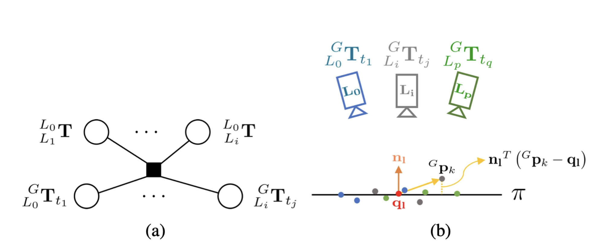
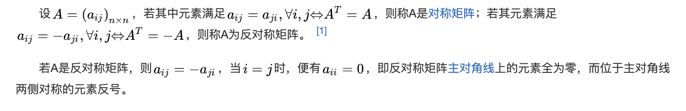

## 文章内容

> &nbsp;&nbsp;&nbsp;&nbsp;&nbsp;&nbsp;&nbsp;&nbsp;&nbsp;&nbsp;&nbsp;&nbsp;With adaptive voxelization, we can obtain a set of voxels of different sizes. Each voxel contains points that are roughly on a plane and creates a planar constraint for all LiDAR poses that  have points in this voxel. More specifically, considering the $l-th$ voxel consisting of a group of points $\mathcal{P}_{l}={_{}^{G}P_{L_{i},t_{j}}}$ scanned by $L_{i} \in \mathcal{L}$ at times $t_{j} \in \mathcal{T}$. We define a point cloud consistency  indicator $_{c_{l}}(_{L_{i}}^{G}T_{t_{j}})$ which forms a factor on $\mathcal{S}$ and $\mathcal{E}_{L}$ shown in Fig. 4(a). Then, the base LiDAR trajectory and extrinsic are estimated by optimizing the factor graph. A natural choice   for the consistency indicator $c_{l}(\cdot)$ would be the summed Euclidean distance between each $_{}^{G}P_{L_{i},t_{j}}$ the plane to be estimated (see Fig. 4(b)). Taking account of all such indicators within the voxel map, we could formulate the problem as $$\arg\min_{{\mathcal{S},\mathcal{E}_{L},\mathbf{n}_{l},\mathbf{q}_{l}}}\sum_{l}\underbrace{{\left(\frac{1}{N_{l}}\sum_{k=1}^{{N_{l}}}\left(\mathbf{n}_{l}^{T}\left(^{G}\mathbf{p}_{k}-\mathbf{q}_{l}\right)\right)^{2}\right)}}_{{l\mathrm{-th~factor}}}$$， where $_{}^{G}p_{k}\in \mathcal{P}_{l}$, $N_{l}$ is the total number of points in $\mathcal{P}_{l}$, $n_{l}$ is the normal vector of the plane and $q_{l}$ is a point on this plane.

Fig.4 :(a) The $l-th$ factor item relating to $\mathcal{S}$ and $\mathcal{E}_{L}$ with $L_{i} \in \mathcal{L}$ and $t_{j} \in \mathcal{T}$ . (b) The distance from the point $_{}^{G}p_{k}$ to the plane $\pi$.

 &nbsp;&nbsp;&nbsp;&nbsp; &nbsp;&nbsp;&nbsp;&nbsp;通过自适应体素化，我们可以获得一组不同大小的体素。每个体素包含大致在一个平面上的点，并为所有包含在此体素内的雷达姿态创建一个平面约束。更具体地说，考虑由$L_{i} \in \mathcal{L}$在时刻$t_{j} \in \mathcal{T}$扫描的一组点组成的第$l$个体素。我们定义了一个点云一致性指标$_{c_{l}}(_{L_{i}}^{G}T_{t_{j}})$ ，它在图4(a)中形成了$\mathcal{S}$ 和 $\mathcal{E}_{L}$上的因子。然后，通过优化因子图来估计基准雷达的轨迹和外参。对于一致性指标$c_{l}(\cdot)$的一个自然选择是计算每个$_{}^{G}P_{L_{i},t_{j}}$到平面的欧几里得距离之和（见图4(b)）。考虑到体素图中所有这样的指标，我们可以将问题表述为$$\arg\min_{{\mathcal{S},\mathcal{E}_{L},\mathbf{n}_{l},\mathbf{q}_{l}}}\sum_{l}\underbrace{{\left(\frac{1}{N_{l}}\sum_{k=1}^{{N_{l}}}\left(\mathbf{n}_{l}^{T}\left(^{G}\mathbf{p}_{k}-\mathbf{q}_{l}\right)\right)^{2}\right)}}_{{l\mathrm{-th~factor}}}$$，其中 $_{}^{G}p_{k}\in \mathcal{P}_{l}$，$N_{l}$ 是 $\mathcal{P}_{l}$中所有点的总点数, $n_{l}$ 是平面的法向量， $q_{l}$ 是平面中的一点。
 
 Fig.4 :(a) 第$l$ 个因子项，涉及$\mathcal{S}$ 和 $\mathcal{E}_{L}$，其中  $L_{i} \in \mathcal{L}$ 且 $t_{j} \in \mathcal{T}$ 。 (b)点 $_{}^{G}p_{k}$到平面$\pi$的距离.

 > &nbsp;&nbsp;&nbsp;&nbsp;&nbsp;&nbsp;&nbsp;&nbsp;&nbsp;&nbsp;&nbsp;&nbsp;&nbsp;&nbsp;It is noticed that the optimization variables $(n_{l}, q_{l})$ in (2) could be analytically solved (see Appendix A) and the resultant cost function (3) is over the LiDAR pose $_{L_{i}}^{G}T_{t_{j}}$ (hence the base LiDAR trajectory $\mathcal{S}$ and extrinsic $\mathcal{E}_{L}$) only, as follows $$ \arg\min_{\mathcal{S},\mathcal{E}_{L}}\sum_{l}^{}\lambda_{3}(A_{l}) $$ where $\lambda_{3}(A_{l})$ denotes the minimal eigenvalue of matrix $A_{l}$ defined as $$ A_{l}=\frac{1}{N_{l}}\sum_{k=1}^{N_{l}}{_{}^{G}p_{k} \cdot_{}^{G}p_{k}^{T}-q_{l}^{\ast}\cdot {q_{l}^{\ast}}^{T}},q_{l}^{\ast} =\frac{1}{N_{l}}\sum_{k=1}^{N_{l}}{_{}^{G}p_{k}}$$ . To allow efficient optimization in (3), we derive the closedform derivatives w.r.t the optimization variable $x$ up to secondorder (the detailed derivation from (3) to (5) is elaborated in Appendix B):$$\lambda_3(\mathbf{x}\boxplus\delta\mathbf{x})\approx\lambda_3(\mathbf{x})+\mathbf{\bar{J}}\delta\mathbf{x}+\frac12\delta\mathbf{x}^T\mathbf{\bar{H}}\delta\mathbf{x}$$ ,where $\bar{J}$ is the Jacobian matrix, and $\bar{H}$  is the Hessian matrix.The $\delta{x}$  is a small perturbation of the optimization variable $x$:$$\mathbf{x}=[\underbrace{\cdots_{L_{0}}^{G}\mathbf{R}_{t_{j}}\quad L_{0}^{G}\mathbf{t}_{t_{j}}\cdots}_{\mathcal{S}}\underbrace{\cdots_{L_{i}}^{L_{0}}\mathbf{R}_{L_{i}}^{L_{0}}\mathbf{t}\cdots}_{\mathcal{E}_{L}}]$$ .Then the optimal $x^{\ast}$ could be determined by iteratively solving (6) with the LM method and updating the $\delta{x}$ to $x$.
$$(\bar{\mathbf{H}}+\mu\mathbf{I}) \delta\mathbf{x}=-\bar{\mathbf{J}}^T$$

 &nbsp;&nbsp;&nbsp;&nbsp; &nbsp;&nbsp;&nbsp;&nbsp;注意到优化变量$(n_{l}, q_{l})$在方程(2)中可以解析求解（详见附录A）,由此得到的损失函数(3)仅关于雷达姿态$_{L_{i}}^{G}T_{t_{j}}$(即基准雷达轨迹$\mathcal{S}$和外参$\mathcal{E}_{L}$),如下所示：
$$ \arg\min_{\mathcal{S},\mathcal{E}_{L}}\sum_{l}^{}\lambda_{3}(A_{l}) $$
其中$\lambda_{3}(A_{l})$表示矩阵 $A_{l}$的最小特征值， $A_{l}$定义为$$ A_{l}=\frac{1}{N_{l}}\sum_{k=1}^{N_{l}}{_{}^{G}p_{k} \cdot_{}^{G}p_{k}^{T}-q_{l}^{\ast}\cdot {q_{l}^{\ast}}^{T}},q_{l}^{\ast} =\frac{1}{N_{l}}\sum_{k=1}^{N_{l}}{_{}^{G}p_{k}}$$
。为了使式(3)中的优化高效，我们推导了优化变量$x$的二阶闭式导数(从(3)到(5)的详细推导见附录B)：
$$\lambda_3(\mathbf{x}\boxplus\delta\mathbf{x})\approx\lambda_3(\mathbf{x})+\mathbf{\bar{J}}\delta\mathbf{x}+\frac12\delta\mathbf{x}^T\mathbf{\bar{H}}\delta\mathbf{x}$$
。其中$\bar{J}$是雅可比矩阵，$\bar{H}$是海森矩阵。$\delta{x}$是优化变量$x$的小扰动：
$$\mathbf{x}=[\underbrace{\cdots_{L_{0}}^{G}\mathbf{R}_{t_{j}}\quad L_{0}^{G}\mathbf{t}_{t_{j}}\cdots}_{\mathcal{S}}\underbrace{\cdots_{L_{i}}^{L_{0}}\mathbf{R}_{L_{i}}^{L_{0}}\mathbf{t}\cdots}_{\mathcal{E}_{L}}]$$
。然后，最优解$x^{\ast}$可以通过迭代求解公式(6)并使用LM的方法更新$\delta{x}$到$x$来确定。
$$(\bar{\mathbf{H}}+\mu\mathbf{I}) \delta\mathbf{x}=-{\bar{\mathbf{J}}}^T$$
## 理论推导
### 损失函数的降维
#### 推导一：BALM论文的思路
$$\arg\min_{{\mathcal{S},\mathcal{E}_{L},\mathbf{n}_{l},\mathbf{q}_{l}}}\sum_{l}\underbrace{{\left(\frac{1}{N_{l}}\sum_{k=1}^{{N_{l}}}\left(\mathbf{n}_{l}^{T}\left(^{G}\mathbf{p}_{k}-\mathbf{q}_{l}\right)\right)^{2}\right)}}_{{l\mathrm{-th~factor}}}$$
观察上式可知，由于对于平面参数$\pi=(n_{l},q_{l})$的依赖，原始误差函数优化的维度很高。因为平面参数$(n_{l},q_{l})$对于不同的平面是有区别的。我们可以对它们进行优化，如下式所示：
$$\arg\min_{{\mathcal{S},\mathcal{E}_{L}}}\sum_{l}{\left(\min_{n_{l},q_{l}}{\frac{1}{N_{l}}{\sum_{k=1}^{N_{l}} \left( n_{l}^{T}\left( {^{G}p_{k}-q_{l}}\right)\right)^{2}}} \right)} $$
在$(n_{l},q_{l})$两个平面参数优化过程中可以优先优化$q_{l}$，再优化$n_{l}$，下式为优化$q_{l}$。
$$\begin{align}\arg\min_{n_{l},q_{l}}{\frac{1}{N_{l}}{\sum_{k=1}^{N_{l}} \left( n_{l}^{T}\left( {^{G}p_{k}-q_{l}}\right)\right)^{2}}} \\
= \arg\min_{n_{l}}\left( \min_{q_{l}}{\frac{1}{N_{l}}{\sum_{k=1}^{N_{l}} \left( n_{l}^{T}\left( {^{G}p_{k}-q_{l}}\right)\right)^{2}}}\right)\\
=\arg\min_{n_{l}}n_{l}^{T}\left( \min_{q_{l}}{\frac{1}{N_{l}}{\sum_{k=1}^{N_{l}} \left( {^{G}p_{k}-q_{l}}\right)^{2}}}\right)n_{l}
 \end{align}$$
 继续简化关于$q_{l}$参数的优化
 $$\begin{align}\arg\min_{q_{l}}{\frac{1}{N_{l}}{\sum_{k=1}^{N_{l}} \left( {^{G}p_{k}-q_{l}}\right)^{2}}}\\
 =\min_{q_{l}}{\frac{1}{N_{l}}{\sum_{k=1}^{N_{l}} \left( {^{G}p_{k}-q_{l}}\right)\left( {^{G}p_{k}-q_{l}}\right)^{T}}}\end{align}$$
 需要求当上式最小化是$q_{l}$的最优解，我们需要找到上式梯度为0的$q_{l}$的值，因此我们对上式求关于$q_{l}$的导数，如下所示：
$$\begin{align}\frac{\partial}{\partial{q_{l}}} \left( {\frac{1}{N_{l}}{\sum_{k=1}^{N_{l}} \left( {^{G}p_{k}-q_{l}}\right)\left( {^{G}p_{k}-q_{l}}\right)^{T}}}\right) \\
={\frac{1}{N_{l}}{\sum_{k=1}^{N_{l}}  {-({^{G}p_{k}-q_{l})}^{T}}-\left( {^{G}p_{k}-q_{l}}\right)}}\\
= {\frac{1}{N_{l}}{\sum_{k=1}^{N_{l}}  {-2({^{G}p_{k}-q_{l})}}}}\\
=-{\frac{2}{N_{l}}{\sum_{k=1}^{N_{l}}  {({^{G}p_{k}-q_{l})}}}}
\end{align}$$
令上式等于0：
$$\begin{align}-{\frac{2}{N_{l}}{\sum_{k=1}^{N_{l}}  {({^{G}p_{k}}-q_{l})}}}=0 \\
 \sum_{k=1}^{N_{l}}{({^{G}p_{k}-q_{l}})} =0\\
 \sum_{k=1}^{N_{l}}{^{G}p_{k}}-N_{l}q_{l}=0\\
 N_{l}q_{l}=\sum_{k=1}^{N_{l}}{^{G}p_{k}}\\
 q_{l}=\frac{1}{N_{l}}\sum_{k=1}^{N_{l}}{^{G}p_{k}}
 \end{align}$$
由此可知，最优的$q_{l}$是所有$^{G}p_{k}$的均值$q_{l}^{\ast}$,接下来继续简化$n_{l}$
$$\begin{align}\arg\min_{n_{l}}n_{l}^{T}\left( \min_{q_{l}}{\frac{1}{N_{l}}{\sum_{k=1}^{N_{l}} \left( {^{G}p_{k}-q_{l}}\right)^{2}}}\right)n_{l}\\
=\arg\min_{n_{l}}n_{l}^{T}\left( {\frac{1}{N_{l}}{\sum_{k=1}^{N_{l}} \left( {^{G}p_{k}-q_{l}^{\ast}}\right)^{2}}}\right)n_{l}\end{align}$$
其中，$${\frac{1}{N_{l}}{\sum_{k=1}^{N_{l}} \left( {^{G}p_{k}-q_{l}^{\ast}}\right)^{2}}}\\
\Leftrightarrow \frac{1}{N_{l}}\sum_{k=1}^{N_{l}}{_{}^{G}p_{k} \cdot_{}^{G}p_{k}^{T}-q_{l}^{\ast}\cdot {q_{l}^{\ast}}^{T}} $$
需要注意的是上式中$q_{l}^{\ast} \cdot_{}^{G}p_{k}^{T}$与$_{}^{G}p_{k}\cdot{q_{l}^{\ast}}^{T}$两个交叉项在最小化过程中不会对优化结果产生影响，所以两式等价。
所以，带入$$ A_{l}=\frac{1}{N_{l}}\sum_{k=1}^{N_{l}}{_{}^{G}p_{k} \cdot_{}^{G}p_{k}^{T}-q_{l}^{\ast}\cdot {q_{l}^{\ast}}^{T}},q_{l}^{\ast} =\frac{1}{N_{l}}\sum_{k=1}^{N_{l}}{_{}^{G}p_{k}}$$
$$\begin{align}\arg\min_{n_{l}}n_{l}^{T}\left( {\frac{1}{N_{l}}{\sum_{k=1}^{N_{l}} \left( {^{G}p_{k}-q_{l}^{\ast}}\right)^{2}}}\right)n_{l}\\
=\arg\min_{n_{l}}n_{l}^{T}A_{l}n_{l}\end{align}$$
根据瑞利商定理，对矩阵$M$满足如下性质：
$$\lambda_{min}(M)\le \frac{x^{T}Mx}{x^{T}x}\le\lambda_{max}(M),\forall{x}\ne0$$
则关于误差函数，取得最小化，变量$(n_{l}, q_{l}$的优化为公式$$\begin{align}\arg\min_{n_{l}}n_{l}^{T}\left( \min_{q_{l}}{\frac{1}{N_{l}}{\sum_{k=1}^{N_{l}} \left( {^{G}p_{k}-q_{l}}\right)^{2}}}\right)n_{l}\\
=\lambda_{min}(A_{l})\\
=\lambda_{3}(A_{l})\end{align}$$
将其带入$$\begin{align}\arg\min_{{\mathcal{S},\mathcal{E}_{L}}}\sum_{l}{\left(\min_{n_{l},q_{l}}{\frac{1}{N_{l}}{\sum_{k=1}^{N_{l}} \left( n_{l}^{T}\left( {^{G}p_{k}-q_{l}}\right)\right)^{2}}} \right)}\\
=\arg\min_{{\mathcal{S},\mathcal{E}_{L}}}\sum_{l}{\lambda_{3}(A_{l})}\end{align}$$
#### 推导二：该论文中的推导思路
后续补充！
### 二阶闭式导数的推导
#### 推导一：BALM论文的思路
首先引入BALM中两个定理，如下所示:
##### 定理1
> 已知：$$\mathbf{A}=\frac1N\sum_{i=1}^N\left(\mathbf{p}_i-\bar{\mathbf{p}}\right)\left(\mathbf{p}_i-\bar{\mathbf{p}}\right)^T,\bar{\mathbf{p}}=\frac{1}{N}\sum_{i=1}^{N}\mathbf{p}_{i}$$
对于一组点$p_{i}\left(i=1,\dots,\right)$和定义的协方差矩阵$A$,假设$A$具有对应于特征向量的$u_{k}\left(k=1,2,3\right)$,则有$$\frac{\partial\lambda_k}{\partial\mathbf{p}_i}=\frac2N(\mathbf{p}_i-\bar{\mathbf{p}})^T\mathbf{u}_k\mathbf{u}_k^T$$其中,$\bar{p}$是$N$个点的均值。

证明如下：假设点$p_i= [x_{i} , y_{i} , z_{i}]^{T}$以及对应的特征向量矩阵$U={[u_{1} , u_{2} , u_{3} ]}^{T}$。进一步定义$p$是$p_{i}$的一个元素，$p$是$x_{i},y_{i},z_{i}$中其中一个。协方差矩阵$A$可以分解为
$\Lambda=U^{T}AU$,其中:
- $\Lambda$是对角矩阵，其对角线元素是特征值,
$\lambda_{1},\lambda_{2},\lambda_{3}$。
- $U$是一个正交矩阵，其列是$A$的特征向量$u_{1},u_{2},u_{3}$。

对$\Lambda$求导可得下式：
$$
\frac{\partial{}\Lambda}{\partial{p}}=\left( \frac{\partial{U}}{\partial{p}}\right)^{T}AU+U^{T}\left(\frac{\partial{A}}{\partial{p}}\right)U+U^{T}A\left(\frac{\partial{U}}{\partial{p}}\right)\tag{式1}
$$
又因为$\Lambda=U^{T}AU$,可以推导得到$$U^{T}A=\Lambda{}U^{T},AU=U\Lambda\tag{式2}$$,将式1带入式2，可得：
$$
\frac{\partial{}\Lambda}{\partial{p}}=\left( \frac{\partial{U}}{\partial{p}}\right)^{T}U\Lambda+U^{T}\left(\frac{\partial{A}}{\partial{p}}\right)U+\Lambda{}U^{T}\left(\frac{\partial{U}}{\partial{p}}\right)\tag{式3}
$$
又因为：
$$
U^{T}U=I\\
\Longrightarrow {U^{T}\frac{\partial{U}}{\partial{p}}+\left(\frac{\partial{U}}{\partial{p}}\right)^{T}U=0}\tag{式4}
$$
由此可知，$U^{T}\frac{\partial{U}}{\partial{p}}$是一个[反对称矩阵](https://baike.baidu.com/item/%E5%8F%8D%E5%AF%B9%E7%A7%B0%E7%9F%A9%E9%98%B5/9063240)，其对角线元素和0。

因此可得:
$$
\left( \frac{\partial{U}}{\partial{p}}\right)^{T}U\Lambda+\Lambda{}U^{T}\left(\frac{\partial{U}}{\partial{p}}\right)=0\tag{式5}
$$
将式5带入式3中，可得：
$$
\frac{\partial{}\Lambda}{\partial{p}}=U^{T}\left(\frac{\partial{A}}{\partial{p}}\right)U\tag{式6}
$$
又因为$\lambda_{k}={u_{k}}^{T}Au_{k}$,代入式6可得：
$$
\frac{\partial{}\lambda_{k}}{\partial{p}}={u_{k}}^{T}\left(\frac{\partial{A}}{\partial{p}}\right)u_{k}=\frac{\partial{{u_{k}}^{T}Au_{k}}}{\partial{p}}\tag{式7}
$$
此时将标量$p$换回为向量$p_{i}$,得到下式
$$
\frac{\partial{}\lambda_{k}}{\partial{p_{i}}}=\begin{bmatrix} 
\frac{\partial{{u_{k}}^{T}Au_{k}}}{\partial{x_{i}}}&
\frac{\partial{{u_{k}}^{T}Au_{k}}}{\partial{y_{i}}}&
\frac{\partial{{u_{k}}^{T}Au_{k}}}{\partial{z_{i}}}
\end{bmatrix}=\frac{\partial{{u_{k}}^{T}Au_{k}}}{\partial{p_{i}}}\tag{式8}
$$
带入矩阵$A$和$\bar{p}$的定义可得：
$$
\begin{align}
\frac{\partial{}\lambda_{k}}{\partial{p_{j}}}=\frac1N\sum_{i=1}^N{\frac{\partial{{u_{k}}^{T}\left({p}_j-\bar{p}\right)\left(p_j-\bar{p}\right)^Tu_{k}}}{\partial{p_{i}}}}\\
=\frac1N\sum_{j=1}^N{\frac{\partial{\left({p}_j-\bar{p}\right)^{T}{u_{k}}{u_{k}}^{T}\left(p_j-\bar{p}\right)}}{\partial{p_{i}}}}\\
=\frac1N\sum_{j=1}^N{\frac{\partial\left(\left({u_{k}}^{T}\left(p_j-\bar{p}\right)\right)^{T}\left({u_{k}}^{T}\left(p_j-\bar{p}\right)\right)\right)}{\partial{p_{i}}}}\\
=\frac1N\sum_{j=1}^N{2{\left(p_j-\bar{p}\right)^{T}u_{k}}\frac{\partial{u_{k}}^{T}\left(p_j-\bar{p}\right)}{\partial{p_{i}}}}\\
=\frac2N\sum_{j=1}^N{{\left(p_j-\bar{p}\right)^{T}u_{k}}\frac{\partial{u_{k}}^{T}\left(p_j-\bar{p}\right)}{\partial{p_{i}}}}\\
=\frac2N\sum_{j=1}^N{{\left(p_j-\bar{p}\right)^{T}u_{k}}\frac{\partial{u_{k}}^{T}\left(p_j-\left(\frac{1}{N}\sum_{i=1}^{N}p_{i}\right)\right)}{\partial{p_{i}}}}\\
=\frac2N\sum_{j=1}^N{{\left(p_j-\bar{p}\right)^{T}u_{k}}\frac{\partial{u_{k}}^{T}\left(p_j-\left(\frac{1}{N}\sum_{i=1}^{N}p_{i}\right)\right)}{\partial{p_{i}}}}\\
=\frac2N{{\left(p_i-\bar{p}\right)^{T}u_{k}}{u_{k}}^{T}\left(I-\frac{1}{N}I\right)}+\\\frac2N\sum_{j=1,j\ne{i}}^N\left(p_j-\bar{p}\right)^{T}u_{k}{u_{k}}^{T}\left(-\frac{1}{N}I\right)\\
=\frac2N{{\left(p_i-\bar{p}\right)^{T}u_{k}}{u_{k}}^{T}\left(I-\frac{1}{N}I\right)}+\\\frac2Nu_{k}{u_{k}}^{T}\left(-\frac{1}{N}I\right)\sum_{j=1,j\ne{i}}^N\left(p_j-\bar{p}\right)^{T}\\
=\frac2N{{\left(p_i-\bar{p}\right)^{T}u_{k}}{u_{k}}^{T}\left(I-\frac{1}{N}I\right)}+\\\frac2Nu_{k}{u_{k}}^{T}\left(-\frac{1}{N}I\right)\left(\left(\sum_{j=1}^{N}(p_{j}-\bar{p})^{T}\right)-\left(p_i-\bar{p}\right)^{T}\right)\\
=\frac2N{{\left(p_i-\bar{p}\right)^{T}u_{k}}{u_{k}}^{T}\left(I-\frac{1}{N}I\right)}+\\\frac2Nu_{k}{u_{k}}^{T}\left(-\frac{1}{N}I\right)\left(0-\left(p_i-\bar{p}\right)^{T}\right)\\
=\frac2N{{\left(p_i-\bar{p}\right)^{T}u_{k}}{u_{k}}^{T}}
\end{align}\tag{式9}
$$

##### 定理2

#### 推导二：该论文中的推导思路
后续补充！
> 定理1：
## 代码详解
## 参考文献
 [1][《Targetless Extrinsic Calibration of Multiple Small FoV LiDARs and Cameras using Adaptive Voxelization》](https://arxiv.org/pdf/2109.06550)

 [2][《BALM: Bundle Adjustment for Lidar Mapping》](https://www.arxiv.org/pdf/2010.08215)

[3][《BALM论文阅读》——epsilonjohn的博客文章](http://epsilonjohn.club/2020/11/03/%E6%96%87%E7%8C%AE%E9%98%85%E8%AF%BB/BALM%E8%AE%BA%E6%96%87%E9%98%85%E8%AF%BB/)
