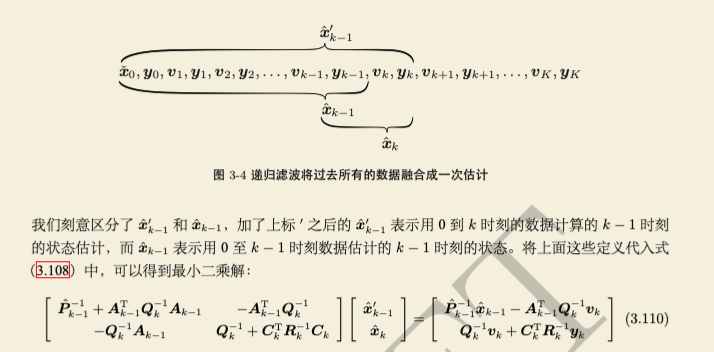
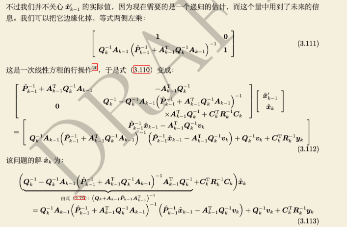
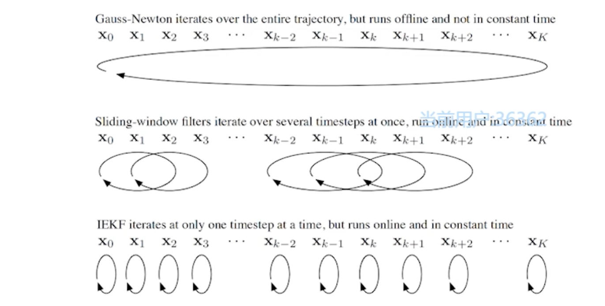

##  从优化角度理解边缘化
###  模型
优化问题具有如下通用形式：
$ HX=b $
并且可以拆解成如下的形式：
$$\begin{bmatrix}H_{mm}&H_{mr}\\H_{rm}&H_{rr}\end{bmatrix}\begin{bmatrix}X_m\\X_r\end{bmatrix}=\begin{bmatrix}b_m\\b_r\end{bmatrix} $$
拆解的目的是通过边缘化将$X_m$从状态量里删除掉，但是要保留它的约束。在划窗模式里，这个$X_m$为要边缘化掉的量。
###  过程
对$H$矩阵利用[舒尔补]() 进行三角化，如下所示：
$$\begin{bmatrix}I&0\\-H_{rm}H_{mm}^{-1}&I\end{bmatrix}\begin{bmatrix}H_{mm}&H_{mr}\\H_{rm}&H_{rr}\end{bmatrix}\begin{bmatrix}X_m\\X_r\end{bmatrix}=\begin{bmatrix}I&0\\-H_{rm}H_{mm}^{-1}&I\end{bmatrix}\begin{bmatrix}b_m\\b_r\end{bmatrix}$$
化简可得：
$$\begin{bmatrix}H_{mm}&H_{mr}\\0&H_{rr}-H_{rm}H_{mm}^{-1}H_{mr}\end{bmatrix}\begin{bmatrix}X_m\\X_r\end{bmatrix}=\begin{bmatrix}b_m\\b_r-H_{rm}H_{mm}^{-1}b_m\end{bmatrix}$$
由上式可得：
$$(H_{rr}-H_{rm}H_{mm}^{-1}H_{mr})X_r=b_r-H_{rm}H_{mm}^{-1}b_{m}$$
意义：此时可以不依赖$X_m$求解出$X_r$,若我们只关心$X_r$的值，则可以把$X_m$从模型中删除。
## 从滤波角度理解边缘化
###  模型
运动模型和观测模型定义（可见《机器人学中的状态估计》3.3.1 ”问题定义“章节）
如下：
$$\begin{align}
x_k=A_{k-1}x_{k-1}+v_k+w_k,&k=1...K\\
y_k=C_kx_k+n_k,&k=0...K
\end{align}$$
###  MAP估计角度
优化目标函数定义（详情参考《机器人学中的状态估计》3.1.2 "最大后验估计" 章节）如下：
$$\hat{x}=arg\underset{x}{min} J(x)$$
其中$J(x)=\sum_{k=0}^{K}(J_{v,k}(x)+J_{y,k}(x)$,$J_{v,k}(x))$见式(3.9.a),$J_{y,k}(x)$见式(3.9.b)。
再次对形式进行以下提升，将所有时刻的状态整理为向量x,并把所有时刻已知数据整理为z。对问题进行一定的简化，可得
$J(x)=\frac{1}{2}\left(z-Hx \right)^{T}W^{-1}(z-Hx)$（式3.14）
对其进行求解最小值，可求解它的一阶导数，并使一阶导为0；
$${\frac{\partial J(x)}{\partial x^{T}}}|_x=-H^{T}W^{-1}(z-H\hat{x})=0 \Rightarrow (H^{T}W^{-1}H)\hat{x}=H^{T}W^{-1}z$$
*注：此时形式以及是接近优化角度的$HX=b$。*
###  滤波角度
 由于马尔可夫性，当前时刻仅与前一时刻有关，由此再次参考 3.3.2章节 "通过MAP推导卡尔曼滤波"，
 假设已经有了k-1时刻的后验估计$ \{ \hat {x}_{k-1} ,\hat{P}_{k-1}\}$,目标是计算$ \{ \hat {x}_{k} ,\hat{P}_{k}\}$，我们使用k-1时刻的后验估计加上k时刻的$v_k$,$y_k$来估计$ \{ \hat {x}_{k} ,\hat{P}_{k}\}$。
 为了推导该过程，定义
 $$ z=\begin{bmatrix}\hat{x}_{k-1}\\v_k\\y_k\end{bmatrix},H=\begin{bmatrix}I&&\\-A_{k-1}&I\\&&C_{k}\end{bmatrix},W=\begin{bmatrix}\hat {P}_{k-1}&&\\&Q_k&\\&&R_k\end{bmatrix}$$
 则模型的解为$$(H_{k}^{T}W_{k}^{-1}H_{k})\hat{x}=H_{k}^{T}W_{k}^{-1}z_k$$，
 其中$$\hat{x}=\begin{bmatrix}\hat{x'}_{k-1}\\\hat{x}_k\end{bmatrix}$$

借助本文第一节，目标为从$x$变量中删除$\hat{x'}_{k-1}$，执行舒尔补可得

