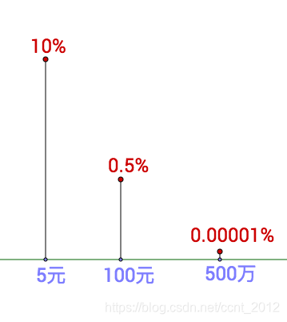
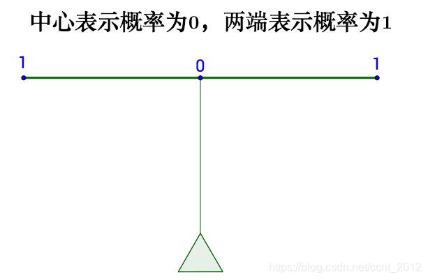
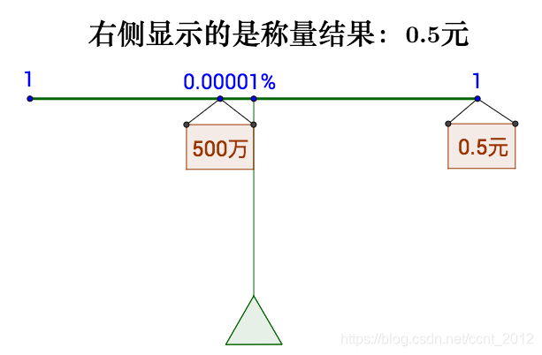
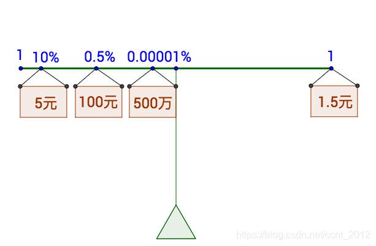
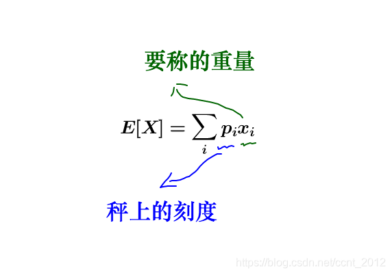

## 概率论中的“矩”

### 彩票的问题
假设福利彩票，每一注两元钱，且中奖的概率分布如下：

其中，概率的“称”如下所示：

此时我们称量一下中奖500万元：

上述结果表明：不确定的500万元等价于确定的0.5元。此时将所有的中奖概率刻画上去：

上述结果等于$$1.5 = 5\times 10\% + 100\times0.5\% + 5000000\times0.000001\% $$
结果表明一张彩票成本两元，但是期望获得的收益为1.5元，每买一张都会亏损0.5元。
## “矩”
### 一阶矩
    上述我们计算的就是概率的一阶矩，也就是期望（expectation/mean）。
$$
E[X]=\sum p_{i}x_{i}
$$

含义如下：

### 二阶矩
二阶矩是广为认知的协方差矩阵$\Sigma$ 
$$
    \Sigma=E[(X-\mu)^{2}]=\sum_{i}p_{i}(x_{i}-\mu)^{2}
$$
### 高阶矩
三阶矩称为偏度，四阶矩称为峰度。各有用途但是共同的特点为称量之后才能使用。
## 参考链接
 [1][如何理解概率论中的“矩”？](https://matongxue.blog.csdn.net/article/details/109766892)